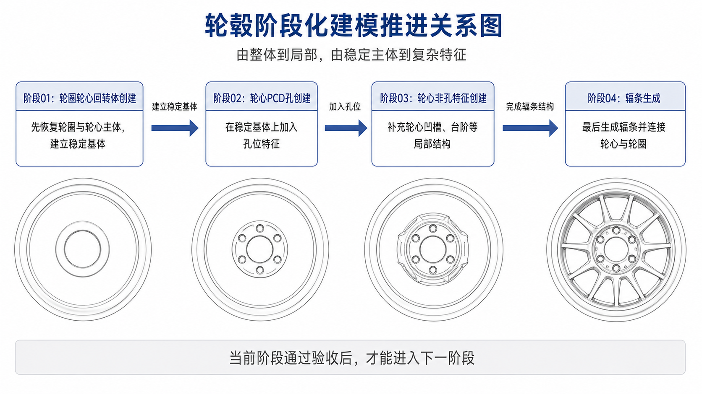
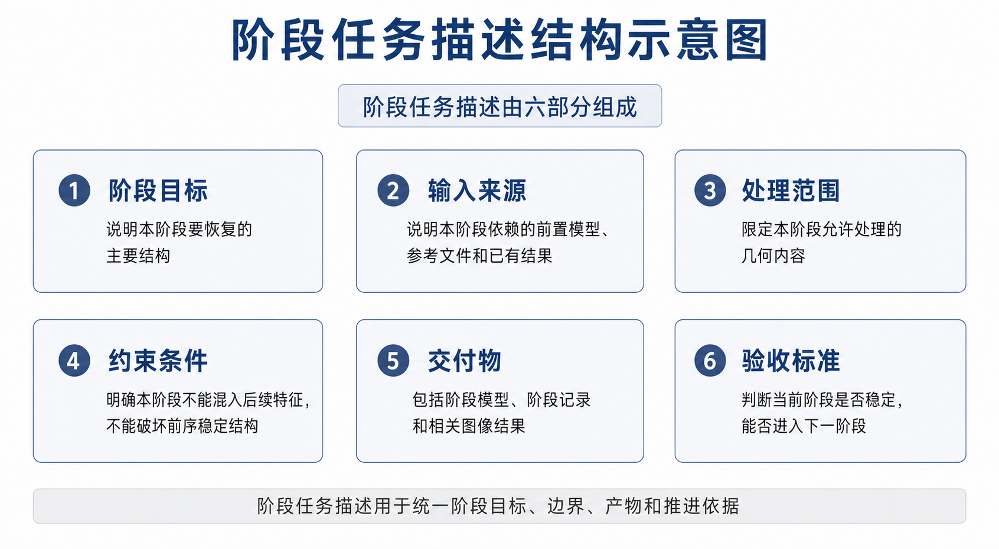
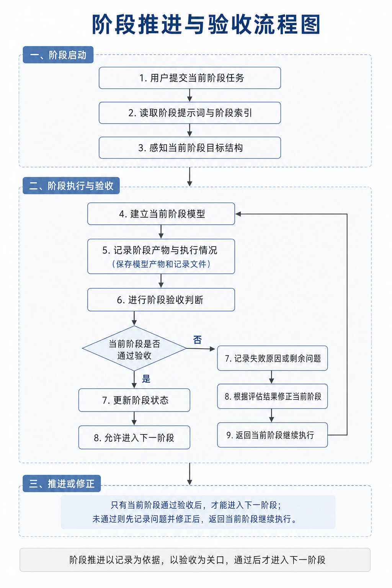
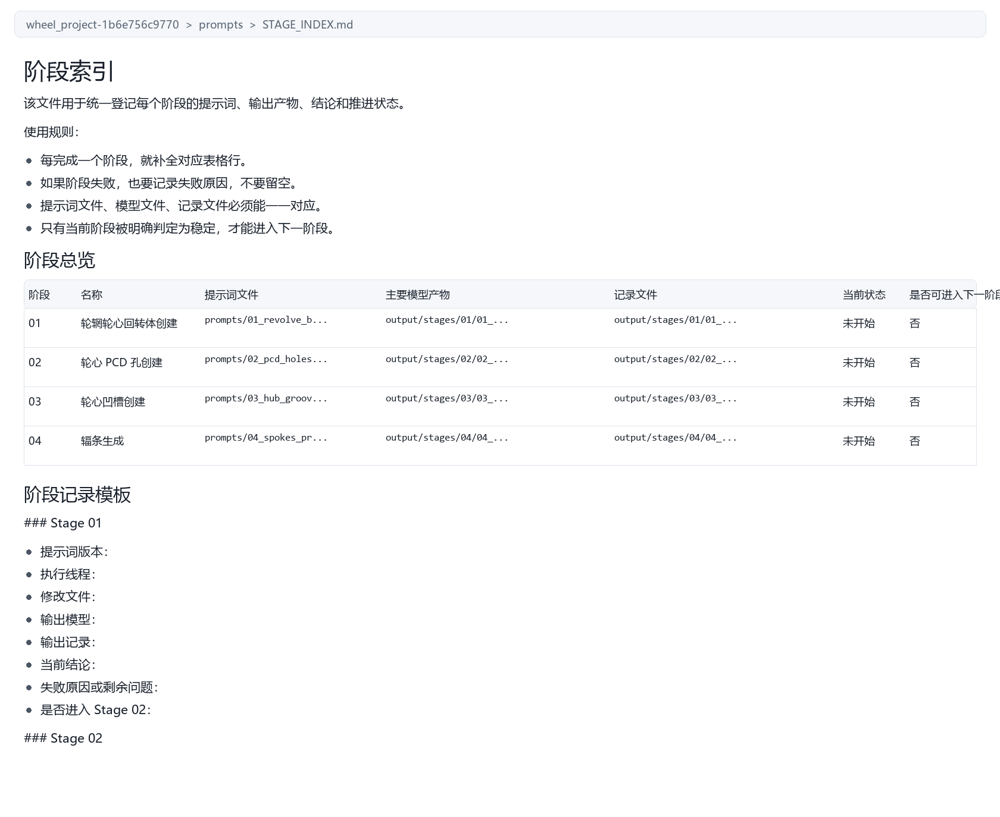
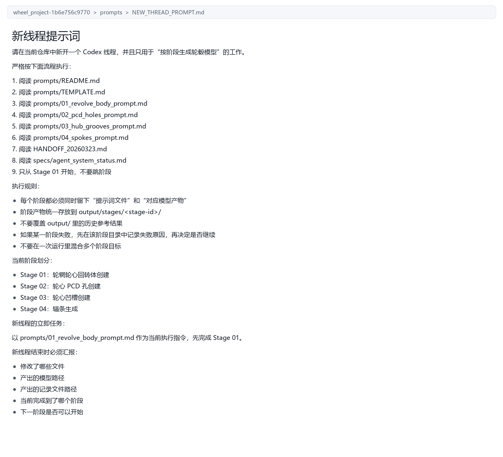
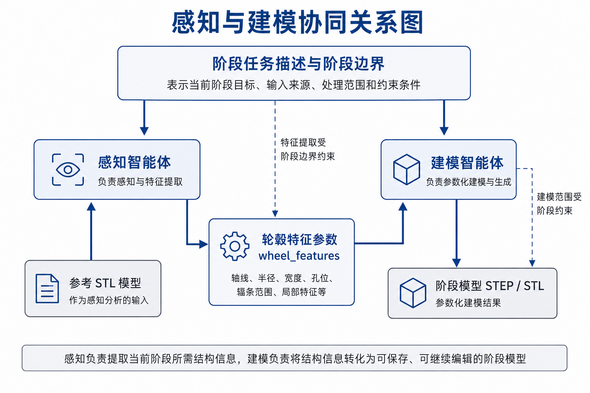
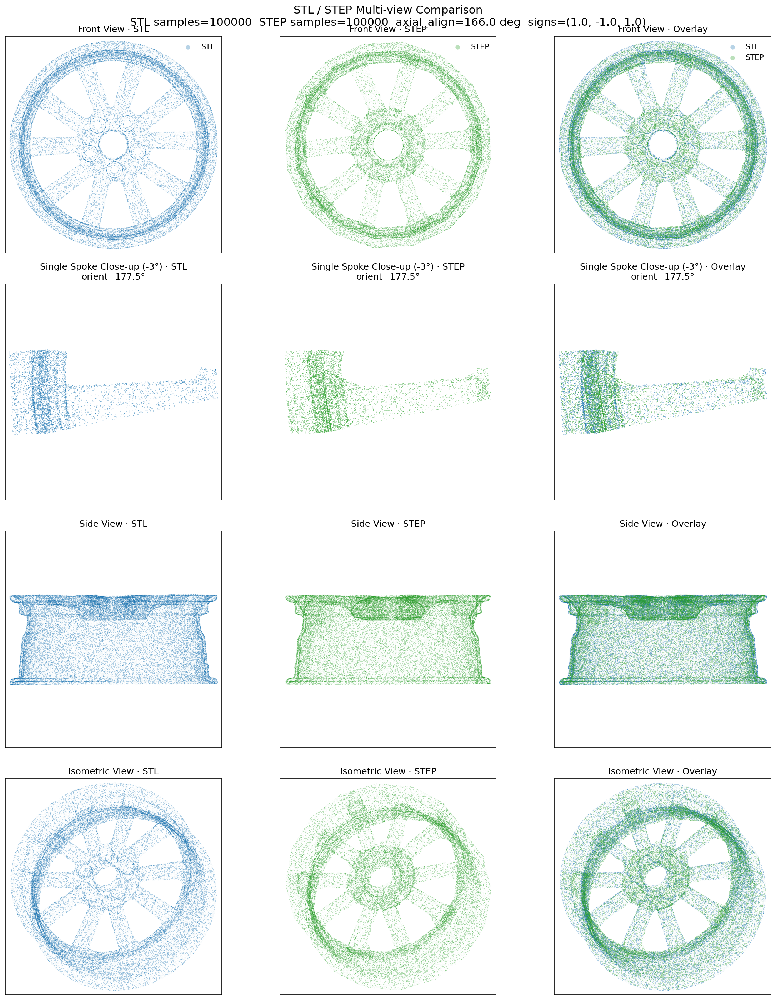
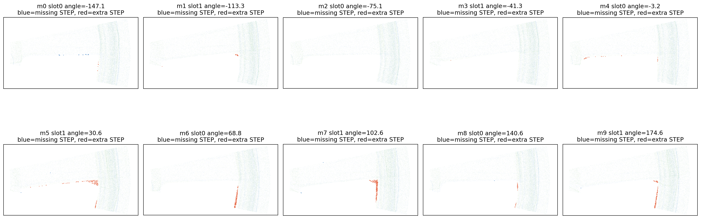
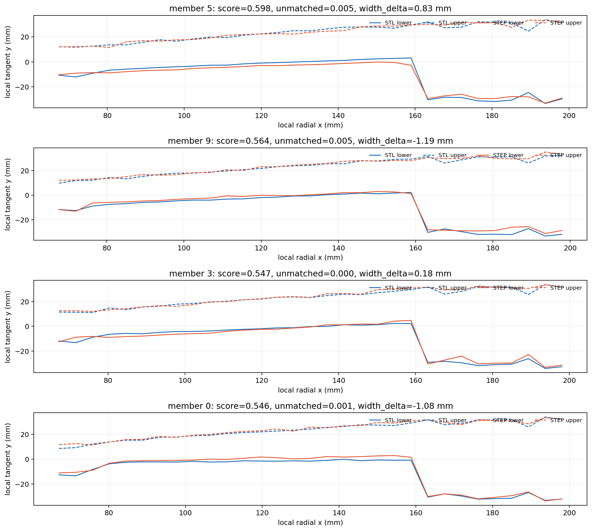
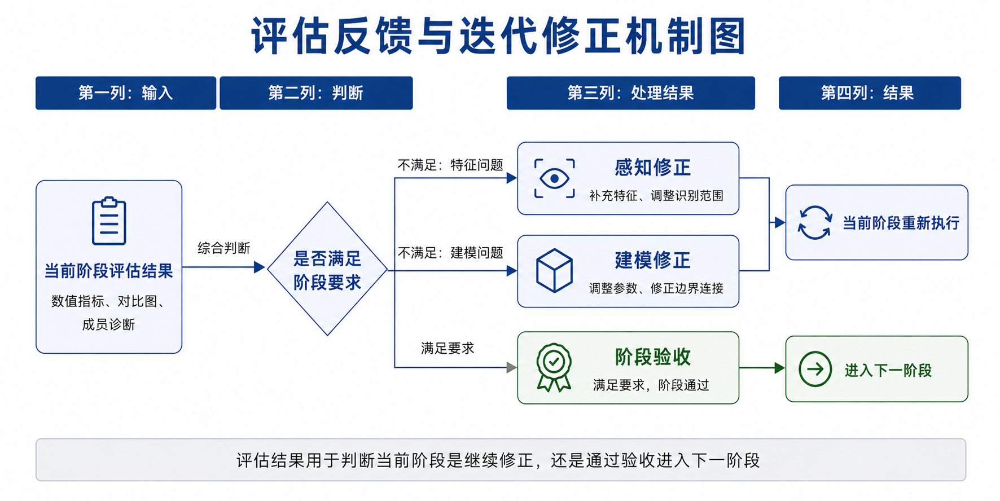

# 第3章 阶段化建模方法与阶段推进方法

## 3.1 阶段化建模思路

轮毂逆向建模的难点，不只在于几何结构本身比较复杂，还在于不同结构之间有较强的依赖关系，轮辋和轮心主体带有明显的回转体特征，适合先通过截面轮廓和轴向关系恢复出稳定基体，PCD 孔、轮心局部特征和辐条则属于局部结构，如果主体还没稳定就提前把这些内容加进来，后续修正就容易变成多个问题混在一起处理，所以，本文没有采用一次性生成完整轮毂模型的方式，而是把建模任务拆成边界较清楚的几个阶段，让系统先得到稳定主体，再逐步补充局部特征。

本文把轮毂逆向建模过程划分为四个阶段，第一阶段是轮辋轮心回转体创建，目标是恢复轮毂主体外形和轮心的基本支撑结构，为后续局部特征提供稳定基准，第二阶段是 PCD 孔创建，目标是在稳定的轮心主体上构建螺栓孔的数量、分布圆和孔位关系，第三阶段是轮心非孔特征创建，目标是补充轮心区域中不属于孔位的局部凹陷、凸台或环形结构，避免和孔位逻辑混在一起，第四阶段是辐条生成，目标是在已有主体和轮心结构基础上生成辐条，并处理辐条与轮心、轮辋之间的连接关系。

这种阶段划分体现的是由整体到局部、由稳定结构到复杂结构的建模顺序，第一阶段优先保证轮辋和轮心的比例关系，以及主实体的有效性，第二阶段只关注孔位，不重新改变主体回转体，第三阶段补充轮心非孔特征，避免孔特征和局部轮心形态在同一阶段相互影响，第四阶段再处理自由度更高、局部变化更复杂的辐条，通过这种顺序，系统能降低复杂结构同时参与建模带来的耦合度，也更方便在某一阶段出现偏差时定位问题来源。

图3-1 轮毂阶段化建模推进关系图

在阶段化建模中，每一阶段既是前一阶段的延续，也是下一阶段的前置条件，如果当前阶段还没有达到基本稳定，后续阶段即使继续生成几何，也可能建立在错误基体上，最后让结果更难修正，因此，本文把阶段推进和阶段验收绑定在一起，也就是只有当前阶段的目标、产物和记录都达到要求后，系统才会进入下一阶段，如果阶段结果还不稳定，就优先在当前阶段内部继续修正，而不是让后续阶段来补救。

## 3.2 阶段任务描述方法

为了让四个建模阶段按统一方式推进，本文为每一阶段设置了统一的任务描述结构，阶段任务描述不是简单写出阶段名称，而是同时说明阶段目标、输入来源、处理范围、约束条件、交付物和验收标准，通过这种结构，系统可以知道当前阶段要完成什么，也能知道当前阶段不应该处理哪些内容。

阶段目标用来说明本阶段要恢复的主要结构，比如轮辋轮心回转体阶段强调主体基体的稳定性，PCD 孔阶段强调孔位数量和分布圆关系，轮心非孔特征阶段强调轮心区域的局部形态，辐条阶段强调辐条几何和主体连接，输入来源用来规定当前阶段应该基于哪个前置结果继续建模，避免在后续阶段反复回到原始输入，处理范围用来限定当前阶段的几何边界，使不同阶段的职责保持清楚，约束条件用来避免跨阶段混改，比如在 PCD 孔阶段不重新设计主回转体，在辐条阶段不重新定义轮心孔位，交付物和验收标准则保证阶段结果能够被保存、检查和复盘。

图3-2 阶段任务描述结构示意图

这种阶段任务描述方法的作用，在于把原来容易依赖临时判断的建模过程，转成可记录的任务对象，对于多智能体协同系统来说，任务描述越清楚，协调智能体越容易判断当前任务该交给哪个执行智能体，执行结果也越容易被评估优化智能体检查，对于论文研究来说，阶段任务描述也让建模过程不再只依赖最终模型，而能以阶段资产的形式保留下来。

在本文系统中，阶段任务描述会和阶段索引配合使用，阶段索引用来登记每个阶段的任务名称、阶段产物、记录文件和推进状态，阶段任务描述则用来说明该阶段的目标边界和验收依据，这两部分共同构成阶段推进的管理依据，也能避免建模过程只留下最终结果，却缺少中间产物和阶段结论的问题。

## 3.3 阶段推进与验收方法

阶段推进的核心问题，是判断系统什么时候可以进入下一阶段，如果推进得太早，后续阶段就会建立在不稳定的基体上，如果推进得太慢，又可能在某一阶段反复修正而难以收敛，所以，本文采用“阶段产物、阶段记录和评估结论”结合的方式来进行阶段验收。

阶段产物指的是当前阶段生成的模型文件或可视化结果，第一阶段的阶段产物主要是轮辋轮心回转体模型，第二阶段是在前一模型基础上加入 PCD 孔后的模型，第三阶段是包含轮心非孔特征的阶段模型，第四阶段则是包含辐条结构的完整模型，阶段产物必须和阶段目标对应，不能在某一阶段里提前混入后续阶段任务。

阶段记录用来说明当前阶段的输入、执行过程、主要结果和剩余问题，如果阶段执行成功，记录文件需要说明这一阶段已经满足了哪些验收条件，如果阶段执行失败，记录文件也要说明失败原因和还需要继续修正的位置，通过保留失败记录，系统就能把一次不理想的结果转成后续优化的依据，而不是直接把它丢掉。

评估结论用来判断当前阶段能不能继续推进，本文把评估结论分成两类，一类是当前阶段已经达到基本要求，可以进入下一阶段，另一类是当前阶段还不稳定，需要在本阶段内部继续修正，对于后一种情况，系统不会直接跳到后续阶段，而是由优化环节根据评估结果给出调整方向，再重新组织本阶段执行。

图3-3 阶段推进与验收流程图

在本文系统中，阶段推进和验收并不是只停留在流程图层面，而是落实到了具体的文件载体上，阶段索引文件 `STAGE_INDEX.md` 用来统一登记阶段名称、提示词文件、主要模型产物、记录文件、当前状态和是否可进入下一阶段，这样，系统在推进阶段时就不是凭单次输出结果做判断，而是会同时检查阶段产物是否已经生成、阶段记录是否已经补全、当前状态是否已经更新。

与阶段索引文件配合使用的，还有新线程规则文件 `NEW_THREAD_PROMPT.md`，这份文件进一步规定了阶段执行必须从第一阶段开始，不能跳阶段，阶段失败后要先记录原因，再决定是否继续，同时还要求线程结束时汇报修改文件、模型路径、记录路径、当前阶段和下一阶段是否可开始，这些规则把阶段推进的顺序、失败处理方式和阶段汇报内容固定下来，使阶段验收不只是一个结果判断，而是一个带有记录依据和过程约束的推进机制。

图3-4 阶段索引文件内容示意图

图3-5 新线程阶段执行规则文件示意图

这种推进方法让建模过程有了明确的阶段边界，每一阶段的完成不只是生成一个文件，还意味着该文件、阶段记录和评估结论之间形成了对应关系，对于轮毂逆向建模这类复杂任务来说，这种对应关系能明显提高过程复盘的可行性，也更方便在后续分析中回溯某一阶段为什么能够通过验收，或者为什么需要继续修正。

## 3.4 感知与建模协同方法

在本文系统里，感知和建模不是简单的前后处理关系，而是围绕同一个阶段任务共同工作。感知环节负责回答“当前阶段要识别哪些结构，以及这些结构在轮毂上的位置、尺寸和分布关系是什么”，建模环节负责回答“怎样把这些结构转成可保存、可继续编辑的三维模型”。二者之间并不是直接传递一段自然语言说明，而是通过轮毂特征参数 `wheel_features`、阶段模型文件和阶段记录文件建立联系，这样可以减少口头描述带来的不稳定性，也方便后续评估环节追溯问题来源。

在具体实现中，感知智能体 `PerceptionAgent` 会以 STL 模型为输入，提取轮毂整体尺寸、轮心尺寸、轮辋尺寸、旋转轴、截面轮廓、孔位信息和辐条相关信息，并把这些内容组织成轮毂特征结果文件 `wheel_features.json`。建模智能体 `ModelingAgent` 不直接重新分析原始 STL，而是读取轮毂特征输入对象 `WheelFeatures` 或对应 JSON 文件，再根据其中的结构参数生成 STEP 或 STL 模型。也就是说，感知阶段给出的不是一个最终模型，而是一组能被建模阶段继续使用的结构依据。

这种协同关系在四个阶段中的侧重点不同。在轮辋轮心回转体阶段，感知环节主要提取轮毂轴线、主体半径、宽度范围和截面轮廓，建模环节据此生成轮辋和轮心的稳定基体。在 PCD 孔阶段，感知环节主要关注孔位数量、孔径和分布圆半径，建模环节只在已有轮心主体上创建孔特征，不重新改变上一阶段的主体回转体。在轮心非孔特征阶段，感知环节识别环形凹陷、局部台阶等轮心区域形态，建模环节在保留孔位和主体结构的基础上补充这些局部特征。在辐条阶段，感知环节进一步提取辐条数量、角度分布、径向范围、宽度变化和根部、尾部连接关系，建模环节再把这些信息转成辐条实体并与轮心、轮辋连接。

为了避免不同阶段互相干扰，本文把感知结果和建模范围同时放进阶段任务边界中管理。当前阶段只允许读取本阶段需要的结构信息，也只允许修改本阶段对应的几何内容。例如，PCD 孔阶段可以使用轮心尺寸和孔位参数，但不能重新生成轮辋主体；辐条阶段可以使用辐条成员、径向区间和连接位置，但不能重新定义轮心孔位。这样的处理使感知结果不会被一次性全部交给建模端使用，而是根据阶段目标逐步开放，建模端也不会因为拿到过多信息而提前混入后续特征。

感知与建模之间还需要接受评估结果的反向约束。如果评估图中出现大面积蓝色差异点，说明参考 STL 中存在结构而候选 CAD 中缺少材料，这类问题通常提示感知阶段可能漏掉了某些轮廓、径向范围或成员特征，也可能提示建模阶段的实体宽度、连接范围不足。如果评估图中出现大面积红色差异点，说明候选 CAD 中存在多余材料，这类问题通常提示建模阶段需要收窄轮廓、修正裁剪边界或调整融合范围。通过这种反馈，系统可以把“感知漏识别”和“建模表达不合理”分开讨论，而不是只笼统地认为模型不好。

图3-6 感知与建模协同关系图

通过这种协同方式，系统把感知、建模和评估反馈连接成了可追踪的链路。感知结果提供结构参数，建模结果提供阶段模型，评估结果再指出差异位置和差异类型，协调智能体根据这些信息决定当前阶段是继续修正感知范围，还是调整建模参数，或者进入下一阶段。这样，协同方法不只是多个智能体按顺序运行，而是让每个智能体的输入、输出和边界都能被检查。

## 3.5 评估与迭代修正方法

轮毂逆向建模很难只靠一轮输出就得到稳定结果，所以，本文在阶段内部引入了评估和迭代修正机制。当前项目中的这一环节统一由评估优化智能体负责，它不是只看模型能不能打开，也不是只靠人工主观看一眼，而是调用可视化评估脚本 `run_visual_evaluation_stage.py` 和辐条差异诊断脚本 `diagnose_visual_spoke_differences.py` 来完成结果比较、阶段验收和修正建议生成。评估输入包括参考 STL、候选 STEP 或 STL，以及与该模型对应的 `wheel_features.json`，如果候选结果只有 STEP 文件，评估流程会先导出临时 STL，再进行点云采样和可视化比较。

评估流程的第一层是数值比较。系统会对参考 STL 和候选模型进行确定性采样，常用随机种子为 42，并生成前视、侧视和辐条区域的重合度指标，主要包括前视重合度 `front_overlap`、侧视重合度 `side_overlap`、辐条区域重合度 `spoke_overlap`，以及正向和反向最近邻平均距离 `nn_mean_fwd_mm`、`nn_mean_bwd_mm`。这些指标可以反映候选模型与参考模型在整体外形、厚度方向和辐条区域上的接近程度，但它们只作为判断信号，不能单独作为最终结论。

评估流程的第二层是图像诊断。系统会输出整体对比图 `evaluation_comparison.png`、辐条局部放大图 `evaluation_comparison_spoke_zoom.png`、前视差异图 `visual_full_front_diff.png`、极坐标差异热力图 `visual_polar_heatmap.png`、辐条成员叠加图 `visual_member_overlays.png` 和最差成员轮廓图 `visual_worst_member_profiles.png`。其中，蓝色差异点表示 STL 中有而候选 CAD 中缺少的结构，红色差异点表示候选 CAD 中多出来的结构。相比单纯数值指标，这些图能更直观地指出问题发生在轮辋、轮心、孔位还是辐条连接区域。

图3-7 评估整体对比结果示意图

图3-7说明，评估结果不会只保留一个总分，而是把前视、辐条局部、侧视和轴测几个主要观察方向同时展示出来，这样在阅读结果时可以同时检查整体轮廓、厚度方向和辐条局部的差异位置。对于轮毂这类既有回转体主体、又有局部复杂特征的对象来说，这种多视角对比更适合作为阶段验收依据。

评估流程的第三层是辐条成员诊断。对于辐条这类自由度较高的结构，系统不会只给出一个整体辐条分数，而是会根据感知得到的辐条成员信息，把每个成员单独取出进行比较，并按照 `root`、`mid`、`tail` 三个径向区域统计差异。诊断结果会写入 `visual_spoke_diagnostics.json`，其中包含最差成员编号、槽位编号、诊断角度、视觉误差分数、未匹配点比例、STL-only 点数量、STEP-only 点数量，以及上下边界、中心线和宽度偏差等信息。这样，系统就能判断问题到底集中在辐条根部连接、中段宽度，还是外端连接，而不是把所有辐条问题混成一个笼统结论。

图3-8 辐条成员差异叠加图

图3-9 最差辐条成员轮廓对比图

图3-8把不同辐条成员的局部差异拆开显示，便于判断问题是集中出现在个别成员，还是在整个阵列中重复出现，图3-9则进一步把误差较大的成员轮廓展开成上下边界曲线，直接反映 STL 与 STEP 在宽度、边界位置和局部转折处的偏差，这两类图配合后，评估结果就不再只是“相似”或“不相似”，而是可以具体指出哪一类辐条、哪一段区域更需要修正。

评估完成后，`run_visual_evaluation_stage.py` 会生成汇总文件 `visual_evaluation_stage_summary.json`，把特征文件路径、参考 STL 路径、候选模型路径、指标文件路径、对比图目录、可视化诊断目录、主要数值指标和最差成员列表放在一起。这个汇总文件相当于评估优化智能体的交接产物，后续修正不需要重新猜测问题来源，而是可以直接根据其中的指标和图像结果判断下一轮该调整什么。

评估优化方法不会直接替代建模，而是根据评估结果给出下一轮调整方向。如果前视或侧视重合度低，说明模型整体轮廓、厚度方向或主体比例可能存在问题，需要回到感知范围或主体建模参数上检查。如果辐条区域重合度低，或者最差成员集中在 `mid` 区域，说明辐条中段宽度、轮廓包络或阵列角度可能不合适，需要优先调整辐条截面和轮廓裁剪。如果差异集中在 `root` 或 `tail` 区域，则说明辐条与轮心、轮辋连接处需要修正。如果红色区域反复出现，通常说明 CAD 多建了材料，需要收缩实体或加强裁剪；如果蓝色区域反复出现，则说明候选模型缺少材料，需要补充特征或扩大建模范围。

图3-10 评估反馈与迭代修正机制图

这种方法让系统从一次性输出转成了闭环式推进，它的意义不只在于提高最终模型质量，也在于把每一轮修正的依据都保留下来。对于本文研究的多智能体协同建模系统来说，评估结果既能作为阶段验收依据，也能作为下一轮感知或建模调整的依据，避免感知、建模和评估变成彼此割裂的孤立步骤。

