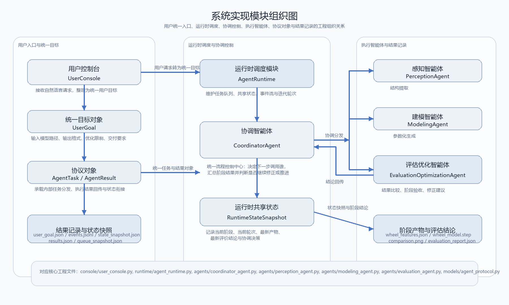
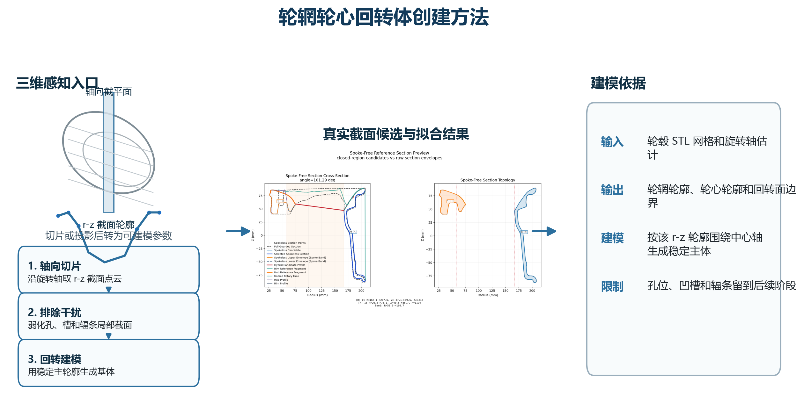
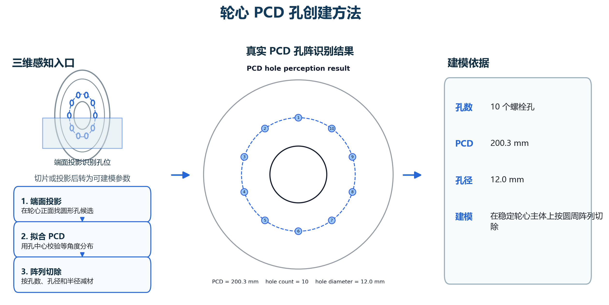
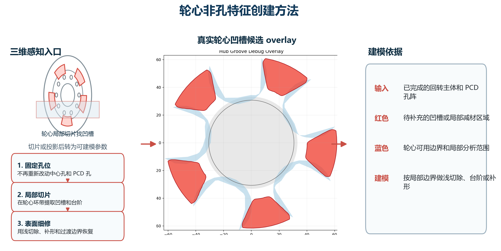
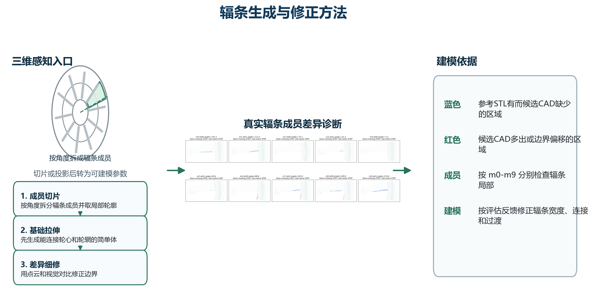
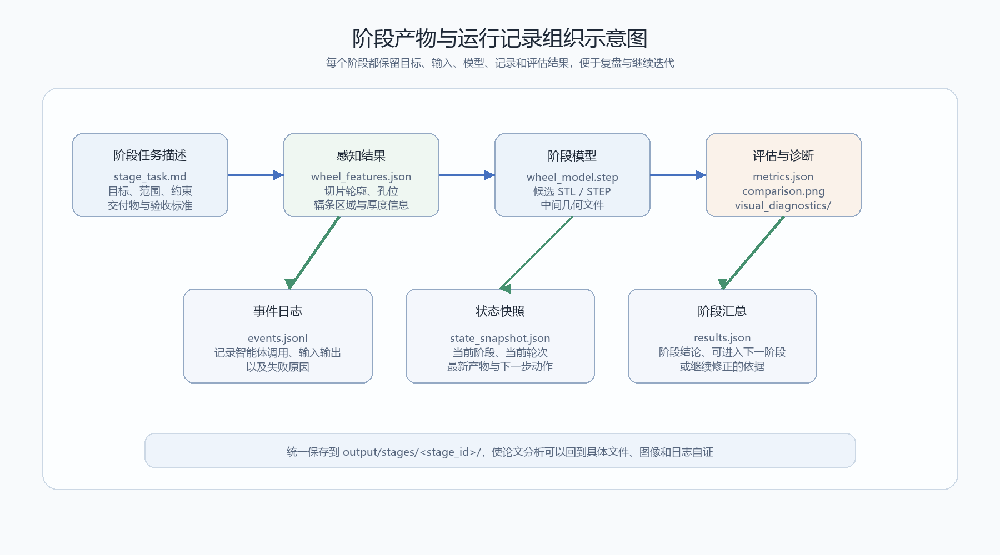
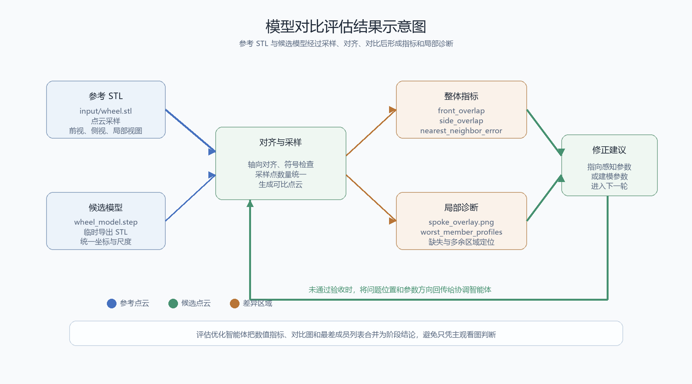

# 第4章 系统实现与实验分析

## 4.1 系统实现

本文系统在实现上，主要围绕用户统一入口、协调控制、阶段执行和结果记录四个方面展开，系统不会让用户分别去调用多个内部模块，而是通过用户控制入口接收建模请求，再把请求整理成系统内部可以识别的目标对象，目标对象进入运行时调度模块以后，由协调智能体控制后续任务流转，感知智能体、建模智能体和评估优化智能体分别处理各自职责范围内的执行任务。

系统程序结构主要包括用户控制台、运行时调度模块、协调智能体、执行智能体、协议对象和结果记录机制，用户控制台用来接收用户请求并把它转换成统一目标，运行时调度模块用来维护任务队列、共享状态和事件日志，协调智能体用来决定当前阶段应该调用哪个执行角色，感知智能体负责结构提取，建模智能体负责参数化模型生成，评估优化智能体负责结果比较、阶段验收和下一轮调整方向生成，协议对象则用来统一不同模块之间传递的数据结构。

图4-1 系统实现模块组织图

在运行过程中，系统会保存用户目标、运行状态、事件记录和阶段结果，用户目标记录本次任务的输入模型、输出格式和迭代限制，运行状态记录当前阶段、当前任务和已有结果，事件记录保存智能体之间的任务流转过程，阶段结果则保存模型文件、阶段记录和评估结果，这些文件共同构成了系统运行的可追踪依据。

和传统脚本式流程相比，本文实现方式的主要区别，在于把运行过程保留下来了，传统脚本通常只关注最终输出文件，一旦输出不理想，就不容易判断问题出在哪一步，本文系统通过运行快照和事件日志，把任务从用户目标到阶段结果的完整流转过程记录下来，这样实验分析就不再只依赖最终模型，也能结合阶段记录和运行状态来说明问题。

## 4.2 阶段化建模实验

为了验证本文方法在轮毂逆向建模任务中的可行性，本文围绕四个阶段组织实验，实验不追求一次性生成完整模型，而是观察系统能不能根据当前阶段的问题，先设计合适的感知方式，再把感知结果转成可执行的建模依据。四组实验分别对应轮辋轮心回转体创建、PCD 孔创建、轮心非孔特征创建和辐条生成，阶段顺序按照由整体到局部、由稳定主体到复杂连接的思路安排。

第一组实验是轮辋轮心回转体创建。本阶段要解决的问题，是怎样从带有孔、槽和辐条干扰的 STL 网格中取出真正可以回转的主体轮廓。如果直接把完整截面用于回转，辐条截面和局部凹槽会混入轮辋边界，外轮廓容易被简化成圆筒，轮心表面也可能带入后续才应该处理的局部特征。针对这个问题，感知环节先估计轮毂旋转轴，再沿轴向取得若干 r-z 截面点云，并在这些截面中区分轮辋外缘、轮辋内壁、轮心主体和干扰区域。感知并不是保留所有可见边界，而是优先寻找在多个角度上都稳定出现的主体轮廓，把孔位、凹槽和辐条截面看作需要削弱的局部信息。建模环节依据清理后的 r-z 轮廓生成回转面，并把轮辋、轮心主体和中心孔组织成一个稳定基体，本阶段不加入 PCD 孔、轮心凹槽和辐条结构。评估时，系统重点检查外径、轴向宽度、轮辋内外壁和轮心主体是否与参考点云保持一致，只有主体结构稳定以后，后续局部特征才有可靠的依附基础。

图4-2 轮辋轮心回转体阶段感知与建模示意图

第二组实验是 PCD 孔创建。本阶段要解决的问题，是在已经生成的轮心主体上补充成组分布的螺栓孔，而不重新改变第一阶段得到的主体边界。PCD 孔属于规律性较强的局部减材结构，它的关键不在单个孔，而在孔数、孔径、分布圆半径和角度间隔是否同时成立。感知环节把范围收缩到轮心端面附近，通过正面投影和局部圆形候选识别找到螺栓孔中心，再检查这些中心点是否围绕中心孔形成近似等角分布。建模环节以第一阶段的轮心主体为基准，先建立 PCD 分布圆，再按感知得到的孔数和半径生成圆形切除体，最后沿轴向完成减材，形成螺栓孔阵列。评估时，系统主要检查孔中心是否落在同一分布圆上、孔径比例是否接近参考模型、孔位是否破坏中心孔和轮心主体边界，如果这些条件不满足，则只调整孔位和孔径参数，不回退修改主体回转体。

图4-3 PCD 孔阶段感知与建模示意图

第三组实验是轮心非孔特征创建。本阶段要解决的问题，是在中心孔和 PCD 孔已经确定以后，继续补充轮心表面的凹槽、台阶、局部凸起和过渡边界等非孔结构。这类结构靠近孔位，又和轮心表面连续相接，如果和孔阵列同时处理，就容易把孔位误差和表面造型误差混在一起。感知环节先把中心孔和 PCD 孔作为已知边界固定下来，再在轮心环带内提取局部切片和正面轮廓，观察剩余区域中哪些位置表现为浅层凹陷，哪些位置表现为台阶或加强边界。建模环节根据这些局部边界，在轮心表面建立环形或分段式的切除区域，并用浅切除、局部补形和过渡圆角来恢复表面层次。评估时，系统会把候选模型与参考点云的前视轮廓进行对比，重点观察凹槽深度、台阶位置和孔周边界是否对齐，若局部特征偏差较大，则只修正轮心非孔特征的角度范围、深度和过渡边界，不重新生成 PCD 孔。

图4-4 轮心非孔特征阶段感知与建模示意图

第四组实验是辐条生成。本阶段要解决的问题最复杂，因为辐条不是回转体，也不是孔阵列，而是连接轮心和轮辋的多成员结构。辐条的数量、角度、宽度、厚度、内端连接和外端连接都会影响最终外观，如果前面主体、孔位和轮心局部特征不稳定，辐条就会缺少可靠的连接基准。感知环节把分析范围放在轮心外圈到轮辋内圈之间的径向区域，先通过正面投影判断辐条数量和中心角，再按角度把辐条区域拆成多个成员，对每个成员提取径向切片和局部轮廓，得到内端位置、外端位置、宽度变化和厚度趋势。建模环节不直接生成复杂自由曲面，而是先根据成员中心线和宽度范围建立简单的辐条拉伸体，使每个辐条先能连接轮心和轮辋；随后再依据切片轮廓和点云差异，对辐条两侧边界、根部过渡和外端连接进行局部细修，可通过放样式切除、边界收缩和局部补形逐步接近参考形态。评估优化环节使用点云采样和视觉对比共同判断结果，点云近邻差异用于发现候选 CAD 相对参考 STL 的缺失或多余区域，前视图、局部放大图和成员叠加图用于判断问题发生在哪个辐条成员、根部还是外端连接处。若某些成员偏差较大，评估优化智能体会把修正建议回传给建模阶段，调整对应成员的宽度、厚度或连接边界，而不是重新推翻已经稳定的轮辋、轮心和孔位。

图4-5 辐条生成阶段感知与建模示意图

在实验组织上，每一阶段都对应阶段任务描述、阶段模型和阶段记录文件，阶段任务描述用来限定本阶段目标和边界，阶段模型用来保存当前输出，阶段记录用来说明执行过程、结果结论和剩余问题，通过这种方式，实验过程就能按阶段进行复盘，而不是只保留最终结果。

## 4.3 结果分析

阶段拆分带来的直接效果是降低轮毂逆向建模中的任务耦合度，轮辋轮心主体、PCD 孔、轮心非孔特征和辐条的建模特征并不一样，如果把它们放在同一流程中同时处理，问题来源就容易混在一起，通过阶段化建模，系统可以在主体稳定以后再添加局部特征，使每一类结构都保留相对独立的分析空间。

在多智能体协同方面，系统把用户请求、流程控制、特征提取、参数建模和评估反馈拆开了，用户只需要提交建模目标，内部任务由协调智能体统一调度，感知智能体、建模智能体和评估优化智能体不直接暴露给用户，也不直接决定全局流程结束，这种设计让系统运行逻辑更清楚，也更方便在论文中说明各模块之间的关系。

过程记录方面，阶段任务描述和阶段产物管理提高了建模过程的可追踪性，每一阶段都有对应的目标、输入、产物和记录文件，实验过程可以按阶段回溯，对于本科毕业设计来说，这一点比较重要，因为论文不只要展示最终模型，也要说明系统怎样组织任务、怎样推进阶段、又怎样把过程记录下来。

图4-6 阶段产物与运行记录组织示意图

评估优化环节中，系统通过结果比较、阶段验收和修正建议为下一轮调整提供依据，这一环节不是简单判断模型像不像，而是围绕当前阶段目标检查结果是否达到要求，如果当前阶段还没稳定，评估优化智能体就会给出下一轮修正方向，再由协调智能体重新组织任务，这样可以避免在错误阶段基础上继续叠加后续结构。

图4-7 模型对比评估结果示意图

实验结果也说明当前系统还存在一些不足，一是复杂辐条结构的几何变化较多，单靠阶段化组织还不能完全解决局部形态恢复问题，后面仍然需要更稳定的感知和建模策略，二是阶段评估目前还较多依赖可视化对比和阶段目标判断，自动化量化指标还不够完善，三是系统虽然已经形成运行记录和阶段产物管理机制，但多轮迭代结果的版本化组织仍然还有继续完善的空间。

总体来看，本文系统在轮毂逆向建模任务中验证了多智能体协同和阶段化建模的可行性，它的优势主要体现在流程组织、问题定位和过程复盘方面，不足则主要集中在复杂局部结构的精细恢复和自动化评估能力方面，这些不足也为后续改进指出了方向。

## 4.4 本章小结

本章介绍了多智能体协同轮毂逆向建模系统的实现方式，并围绕四个阶段开展了实验分析，系统通过用户控制入口、运行时调度模块、协调智能体和执行智能体实现任务流转，通过阶段任务描述和阶段产物记录实现过程追踪，实验结果表明，阶段化建模能降低复杂建模任务的耦合度，多智能体协同机制也能提高流程组织和问题定位的清晰度，同时，系统在复杂辐条结构恢复、自动化评估和多轮结果管理方面仍有继续完善的空间。

