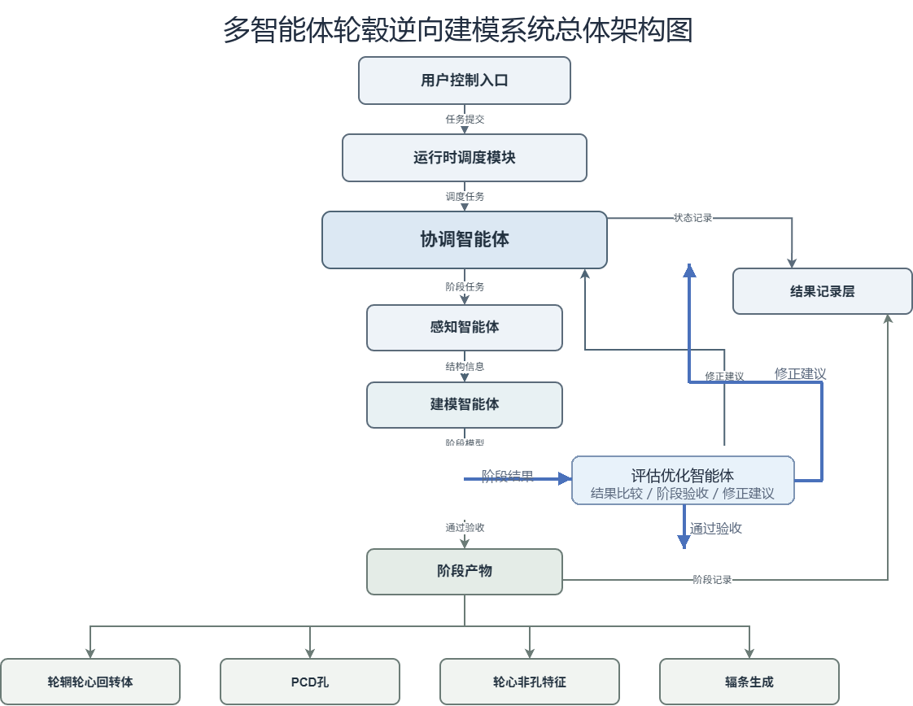
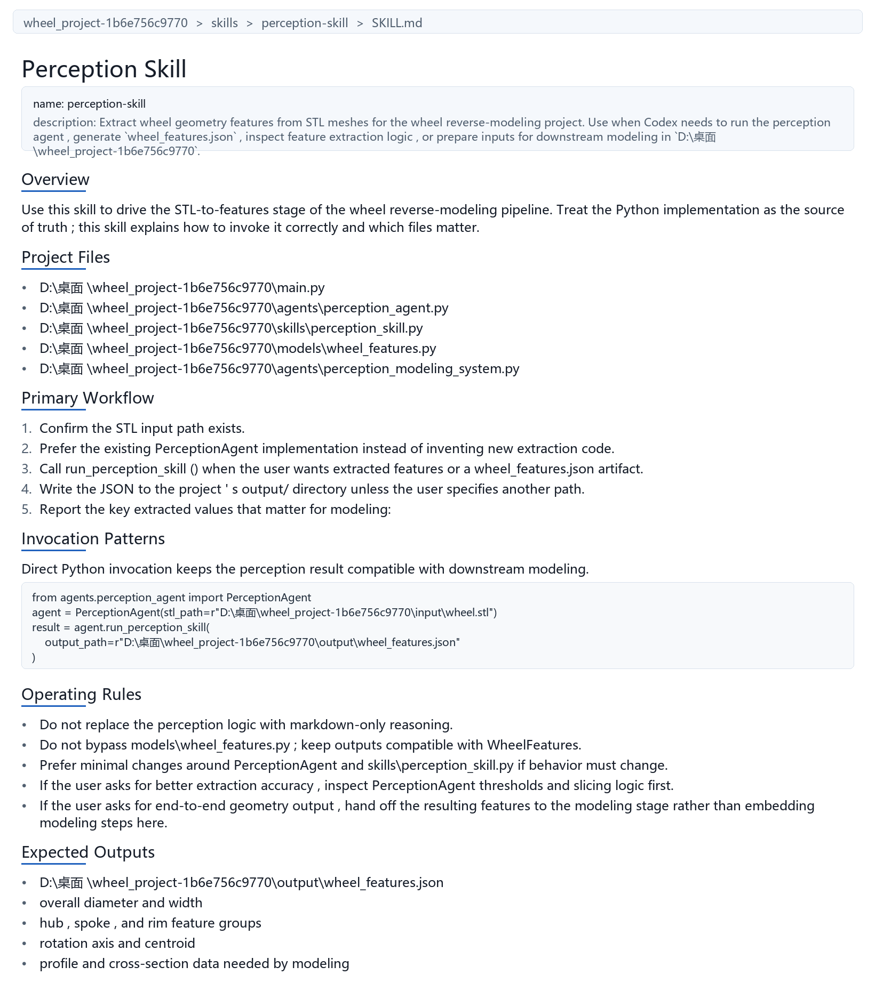
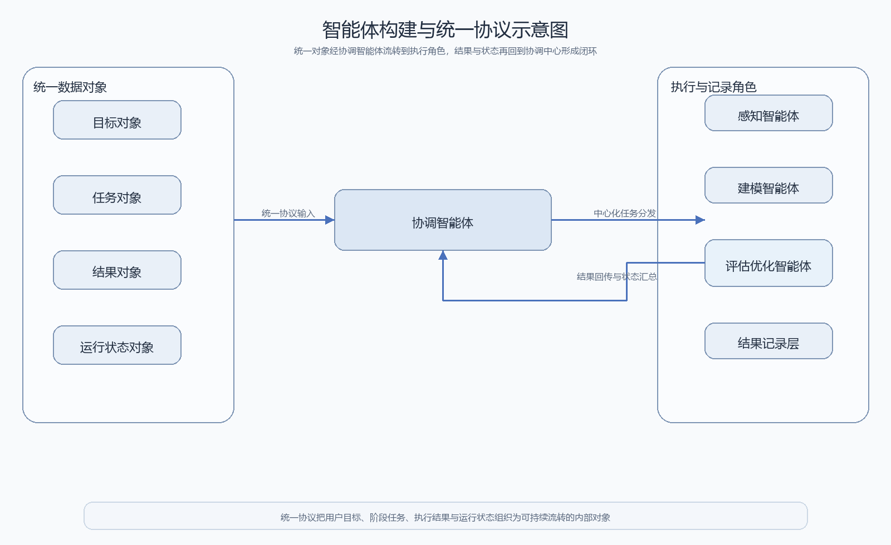
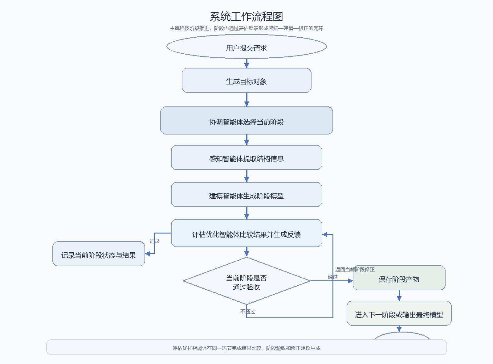

# 华中科技大学本科毕业设计（论文）初稿

## 封面

论文题目：基于多智能体协同的三维轮毂逆向建模系统设计与实现

院系：机械科学与工程学院

专业班级：________________

姓名：________________

学号：________________

指导教师：________________

完成日期：2026年__月__日

## 学位论文原创性声明

本人郑重声明：所呈交的毕业设计（论文）是在指导教师指导下独立完成的研究成果。除文中已经注明引用的内容外，本论文不包含任何他人已经发表或撰写过的研究成果。对本文研究做出重要贡献的个人和集体，均已在文中作了明确说明并表示谢意。本人完全意识到本声明的法律后果由本人承担。

作者签名：________________

日期：2026年__月__日

## 学位论文版权使用授权书

本人完全了解学校有关毕业设计（论文）管理和使用的相关规定，同意学校保留并按规定使用本论文的纸质版和电子版，允许学校在一定范围内进行查阅、借阅、存档和学术交流使用。

作者签名：________________

导师签名：________________

日期：2026年__月__日

## 摘要

本文以轮毂 STL 模型到参数化三维模型的逆向重建任务为研究对象，围绕复杂机械对象在结构恢复、阶段推进和过程复现中的实际问题，设计并实现了一套多智能体协同建模系统。与直接追求一次生成完整模型的方式不同，本文将轮毂建模任务拆分为轮辋轮心回转体、PCD 孔、轮心非孔特征和辐条四个阶段，并通过协调、感知、建模、评估和优化等不同角色的协同工作，形成“感知—建模—评估—修正”的闭环运行机制。

在系统实现方面，本文构建了由用户控制入口、运行时调度模块、协调智能体、执行智能体和结果记录机制组成的整体架构，使各阶段任务能够在统一协议和统一状态管理下执行。为提高方法的可复现性，本文进一步设计了阶段任务描述与过程记录机制，对阶段目标、范围、约束、交付物和验收标准进行统一组织。

实验部分结合轮毂建模四个阶段的阶段产物、运行日志和结果分析，验证了本文方法在轮毂逆向建模中的可行性。研究表明，该方法能够较好地支持阶段化推进和问题定位，但在复杂辐条结构和局部特征精细恢复方面仍有进一步提升空间。

关键词：轮毂逆向建模；多智能体协同；参数化建模；阶段化建模；过程复现

## Abstract

This thesis focuses on the reverse reconstruction task from wheel STL models to parametric three-dimensional models. A multi-agent collaborative modeling system is designed and implemented to address practical problems in structural recovery, staged progression, and process reproducibility for complex mechanical objects. Instead of generating a complete model in a single step, the wheel modeling task is divided into four stages: revolved body reconstruction, PCD hole construction, non-hole hub feature construction, and spoke generation. Through the collaboration of coordination, perception, modeling, and evaluation-feedback roles, a closed-loop workflow of perception, modeling, evaluation, and revision is established.

In terms of system implementation, an overall architecture consisting of a user control entry, a runtime scheduling module, a coordinator agent, execution agents, and a result recording mechanism is constructed, so that tasks in different stages can be executed under unified protocols and unified state management. To improve reproducibility, a stage task description and process recording mechanism is further designed to organize stage goals, scopes, constraints, deliverables, and acceptance criteria in a consistent way.

Experimental results based on stage outputs, runtime logs, and result analysis demonstrate the feasibility of the proposed method in wheel reverse modeling. The study shows that the method is effective for staged progression and problem localization, while further improvements are still needed in complex spoke reconstruction and fine-grained local feature recovery.

Key Words: wheel reverse modeling; multi-agent collaboration; parametric modeling; staged modeling; process reproducibility

## 目录

目录

## 第1章 绪论

### 1.1 研究背景与意义

随着三维扫描、工业视觉和数字化制造技术的发展，复杂零部件的逆向重建已经成为机械设计、零件复现和产品改型中的常见需求。在实际工程场景中，已有零件往往并不具备完整的参数化设计源文件，能够直接获得的通常只有 STL、点云或其他网格化模型。这类模型虽然能够较好地保留目标对象的几何外观，但其本质是离散表示，难以直接用于后续尺寸修改、结构约束、装配设计和工程优化。因此，如何将网格模型进一步恢复为可编辑、可约束、可复用的参数化三维模型，成为逆向建模研究中的重要问题。

轮毂属于典型的复杂机械外观与结构耦合对象，其整体几何通常由轮辋、轮心、孔位、局部轮心特征以及辐条等多类结构共同组成。这些结构既有较强的整体关联性，又存在明显的局部差异性。例如，轮辋和轮心主体更适合通过回转体思路恢复，而孔位、轮心局部特征和辐条则更依赖局部识别与针对性建模。如果将这些结构混在一次建模过程中同时处理，往往会导致问题定位困难、修改代价较高、阶段边界不清晰等问题。特别是在辐条等复杂区域，局部识别误差还可能反向影响轮心和轮辋主体，进一步放大整体建模的不稳定性。

传统的逆向建模方法通常侧重于几何拟合、曲面重建或局部特征提取，在处理规则程度较高的对象时能够取得较好效果，但对于轮毂这类同时包含回转主体与复杂局部结构的对象，单一流程方法往往面临三个问题。第一，任务链路过长，从几何识别到建模输出缺少中间可验证节点，一旦结果偏差较大，难以快速定位问题来源。第二，不同结构之间的依赖关系强，若缺少统一的流程控制，容易在建模过程中出现“前面阶段尚未稳定，后面阶段已经介入”的情况。第三，建模过程通常依赖大量人工试错，虽能逐步逼近目标结果，但难以形成可重复执行、可追踪分析的系统化方法。

基于上述问题，本文选择以轮毂 STL 模型到参数化模型的逆向重建为研究对象，尝试从系统组织方式而不仅仅是几何算法本身入手，对建模过程进行重新设计。本文引入多智能体协同思想，不是为了简单增加“智能”概念，而是为了将原本耦合在一起的建模任务，拆分为可管理、可验证、可迭代的多个执行环节。通过设置协调、感知、建模、评估和优化等不同角色，并建立统一的任务协议和运行时调度机制，可以使轮毂逆向建模从“单次生成一个结果”转变为“分阶段恢复结构并逐轮修正”的闭环过程。

从工程应用角度看，本文研究具有一定实际意义。其一，轮毂属于典型的复杂工业零部件，具有明确的层次结构和参数化价值，以轮毂作为研究对象有助于验证逆向建模系统在复杂机械对象上的适用性。其二，本文强调从网格观测恢复可编辑参数化模型，而不是停留在视觉相似的表面几何，这更符合工程设计和制造场景的真实需求。其三，本文在系统中引入阶段任务描述、阶段产物管理和运行状态记录机制，有助于提高研究过程的复现性和结果解释性，为后续类似零件的逆向建模研究提供参考。

### 1.2 研究现状

逆向建模研究通常围绕几何采集、特征识别、曲面重建和参数化表达等环节展开。在数据获取层面，点云和 STL 网格模型是最常见的输入形式；在几何处理层面，常见方法包括截面分析、曲线拟合、轮廓提取、特征匹配和曲面重构等。对于回转类零件、规则孔位和简单槽型结构，已有研究已经形成较为成熟的处理思路，即通过对几何轮廓进行分解与参数估计，逐步恢复目标零件的结构表达。

然而，当研究对象由规则单体零件扩展到包含多类结构组合的复杂机械对象时，传统方法的局限性开始显现。一方面，复杂零件常常难以依靠单一几何特征完成整体重建，不同部位可能需要采用不同的建模策略。另一方面，在局部结构识别不稳定时，误差会沿建模链路不断积累，使最终结果偏离原始目标。轮毂恰好属于这类问题的典型代表：轮辋与轮心具有较强的回转体属性，而孔位、轮心局部特征和辐条则更依赖局部结构判断，这使得“统一策略一次完成建模”的难度明显增加。

近年来，智能体系统和大语言模型在代码生成、流程组织和任务调度中的应用不断增加，也为复杂工程任务的组织方式提供了新的思路。相较于将全部逻辑集中在单一程序模块中的方式，多智能体协同更强调角色划分、任务传递和结果反馈。对于研究型工程任务而言，这种方法的优势不一定在于某一个单独环节更“智能”，而在于它能够把复杂流程拆开，使每个模块聚焦于较小的职责范围，并通过运行记录保持整体可追踪。

目前，多智能体在软件工程、智能问答、实验流程控制等任务中已经表现出较好的组织能力，但在面向具体机械对象逆向建模，尤其是在“阶段结构恢复+参数化输出+多轮修正”这一完整链路中，仍然缺少足够贴近工程对象的系统化实践。许多现有工作更关注算法精度本身，而对“如何组织整个建模过程”关注不足。换言之，已有研究较少从系统角度回答以下问题：如何把复杂零件拆成适合逐步恢复的阶段，如何判断当前阶段是否已经稳定，如何在失败时保留足够的信息支持回退和修正，以及如何让不同线程或不同轮次的执行结果保持一致的推进逻辑。

因此，本文的研究重点并不在于提出一种全新的底层几何算法，而是围绕轮毂逆向建模这一具体对象，探索一种更适合工程实践的系统组织方法。该方法将阶段建模、任务调度、结果评估和过程记录放入同一套多智能体运行框架中，力图在保留参数化建模目标的前提下，提高复杂对象逆向建模过程的稳定性、可复现性和可分析性。

### 1.3 研究问题

结合当前项目进展与轮毂逆向建模任务特征，本文主要关注以下三个问题。

第一，如何将轮毂逆向建模任务从“直接生成完整模型”转化为“按关键结构逐步恢复”的阶段化过程。对于轮毂而言，轮辋轮心主体、PCD 孔、轮心局部特征和辐条并不是同等难度、同等稳定性的建模对象。如果在主基体尚未稳定时就引入局部细节，容易造成后续结果难以收敛。因此，需要建立更合理的阶段划分方式，并为各阶段设置清晰边界。

第二，如何构建一个既能拆分任务又能保持流程统一的多智能体系统。阶段拆分本身并不困难，真正困难的是如何让多个执行角色围绕同一个目标协同工作，而不是形成各自分离的脚本。为此，需要明确用户入口、协调逻辑、执行角色、结果反馈和状态记录之间的关系，使系统在保留模块独立性的同时，仍能够围绕统一目标稳定运行。

第三，如何提高建模过程的复现性和可追踪性。轮毂逆向建模往往需要多轮尝试，如果每次修改都只存在于临时对话或临时代码中，那么最终虽然可能获得较好的模型，但研究过程难以复盘，也难以形成可直接移植的经验。本文因此进一步关注阶段任务描述、阶段产物保存和运行日志记录，希望把“做模型”这一行为，转化为可记录、可检查、可推进的研究过程。

### 1.4 研究内容

围绕上述问题，本文主要开展以下几方面工作。

（1）构建轮毂逆向建模的多智能体协同系统。本文以当前项目实现为基础，构建由用户控制入口、运行时调度模块、协调智能体、感知智能体、建模智能体、评估智能体和优化智能体组成的系统框架。系统中不同角色之间通过统一任务协议和结果协议进行交互，使其能够在同一运行时环境中完成任务分发、结果回传和状态记录。

（2）设计面向轮毂结构恢复的阶段化建模流程。针对轮毂结构的层次性特点，本文将逆向建模任务划分为四个阶段：轮辋轮心回转体创建、PCD 孔创建、轮心非孔特征创建和辐条生成。各阶段按照由整体到局部、由稳定主体到复杂特征的顺序推进，从而降低结构间相互干扰带来的不稳定性。

（3）建立阶段任务描述与过程记录机制。为了使各阶段具备清晰的目标边界，本文为每一阶段设置统一的任务描述结构，明确该阶段的目标、输入、范围、约束、交付物和验收标准。同时，通过阶段模型文件、阶段记录文件和运行快照文件，对每一轮执行过程进行保存，为阶段复盘和结果分析提供依据。

（4）建立“感知—建模—评估—修正”的闭环运行机制。本文并不把感知、建模、评估视作孤立步骤，而是将其组织成可迭代的闭环：感知负责提供结构依据，建模负责生成参数化结果，评估负责比较结果偏差，优化负责给出下一轮修正建议。通过这种方式，使系统在阶段内部和阶段之间都具备逐步逼近目标结果的能力。

（5）完成系统实现与实验验证。本文结合当前项目中的运行路径、阶段任务文件和阶段产物，对系统运行效果进行验证。实验将围绕四个阶段产物展开，并从阶段边界是否清晰、流程组织是否稳定、结果是否便于复盘等方面分析本文方法的有效性与不足。

### 1.5 论文结构安排

本文共分为五章，各章内容安排如下。

第1章为绪论，主要介绍课题背景、研究现状、研究问题、研究内容以及全文结构安排。

第2章为系统总体方案与智能体构建，重点说明本文多智能体系统的总体架构、角色划分依据、构建方式以及系统工作流程。

第3章为阶段化建模方法与阶段推进方法，重点介绍轮毂四阶段建模思路、阶段任务描述方式、阶段推进与验收机制，以及感知、建模、评估和修正之间的协同关系。

第4章为系统实现与实验分析，介绍系统在当前项目中的具体实现方式，并结合阶段模型、运行日志和实验结果分析本文方法的有效性与局限性。

第5章为总结与展望，对本文工作进行总结，并对后续在复杂局部结构重建、自动化评估和系统扩展方面的工作进行展望。

## 第2章 系统总体方案与智能体构建

### 2.1 系统目标

本文所研究的轮毂逆向建模任务，并不是单纯将 STL 模型转换为另一种三维文件格式，而是希望在已有网格观测的基础上，逐步恢复可编辑、可分析、可继续修改的参数化模型。因此，系统设计的首要目标不是“尽快生成一个看起来接近的结果”，而是构建一条能够稳定推进、便于修正和易于复现的建模链路。

结合当前课题需求，本文将系统目标概括为以下三个方面。

第一，实现轮毂 STL 模型到参数化模型的自动化重建。系统需要以轮毂网格模型作为输入，经过感知分析、参数重建和结果输出，逐步形成能够继续用于建模或装配的三维结果。这一目标强调的是“参数化恢复”，而不是仅仅导出视觉上相似的网格或实体。

第二，支持将复杂建模任务拆解为多个可单独验证的阶段。轮毂结构并不是单一形体，而是由轮辋轮心主体、孔位、轮心局部特征和辐条等多个部分组成。不同部分在建模难度和稳定性上存在明显差异，因此系统需要允许按阶段推进，而不是把所有结构同时压在一次建模过程中处理。

第三，支持结果评估、状态记录和迭代修正。逆向建模过程中，不同阶段可能出现特征提取偏差、局部结构不稳定或参数表达不合理等问题。系统不应只负责生成结果，还应能够记录当前状态、评估阶段效果，并在必要时返回上一步继续修正。只有具备这种能力，系统才不仅仅是一个执行脚本，而是一套可以持续推进的建模框架。

### 2.2 系统总体架构

围绕上述目标，本文构建了一套面向轮毂逆向建模的多智能体协同系统。该系统不是若干独立程序的简单拼接，而是围绕统一目标组织而成的分层结构。整体上，系统可分为用户交互层、运行时调度层、协调控制层、感知建模执行层、评估优化层和结果记录层六个部分。

用户交互层位于系统最外侧，主要负责接收用户输入并将自然语言请求整理为系统可识别的任务目标。对于当前项目而言，用户并不直接与各执行智能体交互，而是统一通过控制台提交请求。这样做的目的，是将“用户表达”和“内部执行”分开，避免用户直接操作多个智能体造成流程混乱。

运行时调度层是系统的基础支撑部分，负责维护任务队列、共享状态和运行日志。它相当于整个系统的执行环境，保证任务能够按照既定顺序推进，并将每一轮执行情况写入状态快照和结果记录中。若缺少这一层，多智能体虽然可以分别存在，但无法形成统一调度和统一追踪的系统。

协调控制层是系统的核心。本文采用协调智能体作为唯一的流程控制中枢，由其负责接收用户目标、分发任务、汇总结果并决定下一步操作。系统中其他智能体并不直接决定全局流程是否结束，也不直接控制阶段切换，而是只返回各自的阶段性结果。这种设计确保了系统推进逻辑始终保持单一出口，便于分析与维护。

感知建模执行层承担具体建模任务，包括感知智能体和建模智能体两个关键角色。感知智能体负责从 STL 模型中提取轮毂几何结构信息，为后续参数化建模提供依据；建模智能体则根据感知结果构建参数化模型，并输出当前阶段的模型结果。之所以将二者拆开，是因为“识别结构”和“生成结构”属于两类不同问题，若由单一模块统一完成，则很难在出错时判断问题到底来源于感知还是建模。

评估优化层位于执行层之后，负责对生成结果进行质量分析并给出下一步调整建议。评估智能体用于比较当前结果与目标结构之间的差异，优化智能体则根据评估结果决定是否进入下一轮修正，以及调整重点应该落在感知阶段还是建模阶段。这使系统具备从失败结果中继续推进的能力，而不是一旦输出不理想就只能重新人工尝试。

结果记录层用于保存阶段模型、运行日志、状态快照以及实验记录。本文之所以强调这一层，是因为课题的研究价值不仅体现在最终模型上，还体现在阶段推进、失败分析和方法复现上。通过保留每一阶段的产物文件和记录文件，可以使系统从“会运行”进一步转化为“可说明、可复现、可复盘”。

如图2-1所示，本文系统并不是将多个脚本简单堆叠，而是围绕统一目标、统一协议和统一运行状态组织起来的分层架构。该图直观展示了用户入口、协调中心、执行层和记录层之间的关系。

图2-1 多智能体轮毂逆向建模系统总体架构图

### 2.3 智能体划分依据

本文中的智能体划分，并不是先抽象出若干“概念角色”再强行映射到任务上，而是从当前轮毂逆向建模的实际工作链路出发进行划分。也就是说，智能体如何划分，不取决于名称是否完整，而取决于是否能够有效承担清晰、独立且可追踪的任务职责。

首先，用户输入与内部执行之间必须分离。用户给出的通常是“希望得到什么结果”，而系统内部需要处理的是“当前阶段应该做什么”。因此，本文将用户请求处理单独放在用户控制入口，而不让用户直接面对感知、建模或优化等内部角色。这样做既有利于维持系统边界，也有利于将自然语言请求转化为统一的目标对象。

其次，流程控制与任务执行必须分离。轮毂逆向建模包含多个阶段，且同一阶段内部还可能发生多轮修正。如果让感知模块或建模模块同时决定流程是否继续，会导致系统逻辑交叉、回退路径不清晰。因此，本文将流程推进权集中交给协调智能体，而把具体执行工作交给各功能智能体承担。

再次，结构识别与参数建模必须分离。轮毂逆向建模的困难之一在于“看到什么”和“如何建出来”并不是同一件事。感知阶段强调从网格中提取结构特征，建模阶段强调如何将这些特征组织为参数化结果。将两者拆分后，即使结果不理想，也可以更快判断是特征提取错误，还是建模表达不合理。

最后，结果评估与参数修正也需要独立出来。若没有独立的评估环节，系统只能凭单轮输出进行主观判断；若没有独立的优化环节，系统也难以形成真正的闭环。因此，本文进一步设置评估智能体和优化智能体，使系统不仅能“做”，还能“判断”和“修正”。

基于以上考虑，本文最终形成了由用户控制入口、协调智能体、感知智能体、建模智能体、评估智能体和优化智能体构成的系统角色划分。这种划分方式既能覆盖轮毂逆向建模的完整工作链路，又能保证不同角色之间职责相对单一、边界清晰。

### 2.4 智能体构建方式

在角色划分明确之后，本文进一步围绕“如何让这些角色真正组成系统”展开构建。本文的构建方式可以概括为三步：先定义统一协议，再组织角色交互，最后通过运行时管理维持整个系统。

第一步是定义统一的数据交互协议。为了避免不同模块之间各自使用不同输入输出格式，本文为系统设计了统一的目标对象、任务对象、结果对象和运行状态对象。用户请求首先被转换为统一的目标对象；系统内部各阶段的执行则由任务对象承载；执行完成后的阶段结果由结果对象回传；运行时则不断更新状态对象，用于保存当前轮次、任务进度和阶段产物位置。通过这一步，系统中的不同智能体可以在同一数据结构上进行协同，而不是彼此直接耦合。

第二步是围绕实际工作流程组织角色交互。用户请求进入系统之后，并不会直接落到感知或建模模块，而是先由协调智能体接收。协调智能体根据当前目标和阶段状态决定下一步任务，并分发给对应的执行智能体。执行智能体完成任务后，再将结果返回协调智能体。若结果需要进入评估或优化，则仍由协调智能体统一调度后续路径。也就是说，本文中的角色不是点对点自由通信，而是以协调智能体为中心形成中心化交互结构。

第三步是利用运行时调度模块维持整个系统。若没有统一运行时，智能体之间即使有角色划分和数据协议，也难以形成稳定流程。因此，本文进一步设置运行时调度模块，用于维护任务队列、保存任务历史、记录结果历史并写入状态快照。它在系统中的作用不是替代智能体判断，而是保证所有任务都在统一执行框架内推进。通过这一层，系统能够持续记录每轮运行中的任务开始、任务完成、阶段切换和结果输出情况。

除了角色与协议本身，本文还在构建方式中加入了阶段任务描述与过程记录机制。也就是说，系统不仅要知道“下一步该由谁做”，还要明确“这一阶段该做到什么程度、产出什么结果、达到什么标准才允许继续”。这部分机制并不直接参与几何计算，但对于多智能体系统的稳定推进非常重要。因为轮毂逆向建模并不是单轮就能完成的任务，阶段边界是否清晰、交付物是否统一、失败是否有记录，都会直接影响后续阶段能否继续。

为了把不同智能体的职责进一步固化为可复用资产，本文在系统实现中引入了 skill 化组织方式。这里所说的 skill，并不是抽象的能力命名，而是与系统中具体执行角色相对应的结构化能力说明单元。结合当前项目实现，本文主要对应三类核心 skill，即感知 skill、建模 skill 和评估 skill。感知 skill 对应 `PerceptionAgent`，负责从 STL 网格中提取轮毂几何特征并生成可供下游使用的特征结果；建模 skill 对应 `ModelingAgent`，负责根据 `WheelFeatures` 或特征文件生成参数化三维模型；评估 skill 对应 `EvaluationAgent` 与可视化评估工具链，负责将候选 STEP 或 STL 结果与参考 STL 进行比较，并输出评价指标与可视诊断结果。

从结构上看，这三类 skill 在项目中均采用 `SKILL.md` 形式组织，其内容并不是随意书写的提示文本，而是围绕实际执行路径展开。根据当前项目中的感知、建模和评估 skill 文件，可以将其共同结构概括为两部分。第一部分是元信息区，通常用于给出 skill 名称、功能描述和适用范围，用来说明该 skill 在系统中的职责定位。第二部分是正文说明区，通常包含功能概述、相关项目文件、主要工作流、调用方式、运行规则和预期输出。这样的组织方式，使 skill 既能向协调层说明“当前能力负责什么”，又能向执行层说明“当前能力依赖哪些文件、按什么路径执行、最终输出什么结果”。

以感知 skill 为例，其核心内容包括 STL 到特征提取的功能概述、`PerceptionAgent` 与 `wheel_features` 相关文件、特征提取主流程、典型调用方式以及预期生成的 `wheel_features.json` 等结果。建模 skill 的核心内容则围绕 `ModelingAgent`、`WheelFeatures` 输入、STEP 或 STL 输出路径以及参数化建模过程展开。评估 skill 的核心内容则围绕候选模型与参考 STL 的对比方式、可视化评估流程、评价指标和评估结果输出展开。可以看出，这里的 skill 不是单纯记录“该做什么”，而是把能力边界、执行依据、文件依赖、调用方式和结果形态一起固化下来。

从原理上看，这种 skill 组织方式来源于三个需求。第一，来源于多智能体协同中的职责划分需求，即感知、建模和评估需要形成稳定分工，而不是在运行过程中临时定义职责。第二，来源于工程执行需求，即每类能力都必须与实际代码路径和输入输出文件保持一致，不能停留在纯文字层面。第三，来源于过程复现需求，即论文研究不仅要说明系统有这些能力，还要说明这些能力在工程中如何被调用、依赖什么文件、产出什么结果。因此，skill 既具有运行约束作用，也具有研究记录作用。

如图2-4所示，当前项目中的 `SKILL.md` 文件可以按照元信息区、功能概述区、项目文件区、主要工作流区、调用方式区、运行规则区和预期输出区进行分区域说明。若在论文中配合截图展示，可以分别标注这些区域对应的作用来源：元信息区用于定义能力身份与适用范围，功能概述区用于说明该能力在系统链路中的位置，项目文件区用于说明能力依赖的代码来源，主要工作流区用于说明执行逻辑，调用方式区用于说明能力如何被运行时触发，运行规则区用于说明边界控制，预期输出区则用于说明该能力向下游或记录层提交的产物类型。

图2-4 感知、建模与评估 skill 结构示意图

通过上述构建方式，本文最终形成了一套以统一协议为基础、以协调调度为核心、以执行智能体为主体、以运行时记录为支撑的多智能体逆向建模系统。与单脚本或单模块方式相比，这种构建方式更有利于支撑复杂对象的阶段化恢复和问题定位。

如图2-2所示，智能体的构建重点并不在于角色命名本身，而在于是否已经形成统一的数据对象、中心化的交互路径和可持续记录的运行机制。该图说明了“协议定义”和“角色交互”之间的对应关系。

图2-2 智能体构建与统一协议示意图

### 2.5 系统工作流程

基于以上架构和构建方式，本文系统的运行过程可以归纳为一条清晰的工作链路。

首先，用户通过控制台输入建模目标。该目标通常包括输入模型路径、输出形式以及对当前任务的基本要求。用户控制入口会对这些信息进行整理，并生成系统内部统一使用的目标对象。

其次，运行时调度模块接收该目标对象，并创建初始任务。此时系统进入正式执行状态，协调智能体成为流程控制中心。它读取当前目标和系统状态后，决定首先进入哪个执行环节。

然后，系统进入感知阶段。感知智能体围绕当前阶段任务，从轮毂 STL 模型中提取关键结构信息，并输出结构化结果。这些结果不直接作为最终交付物，而是作为建模阶段的输入依据。

在获得感知结果后，协调智能体将任务转交建模智能体。建模智能体依据当前阶段的特征结果，生成对应的参数化模型。例如，在前期阶段更侧重稳定恢复轮辋轮心回转体，在后续阶段再逐步加入孔位、轮心非孔特征和辐条等局部结构。

建模结果生成后，系统进入评估阶段。评估智能体负责比较当前结果与目标结构之间的差异，并形成阶段质量判断。若结果已经满足当前阶段要求，则协调智能体将该阶段模型和阶段记录保存下来，并判断是否进入下一阶段。若结果尚未满足要求，则系统进入优化阶段。

优化智能体根据评估结果给出下一轮修正建议。这些建议可能指向感知参数的调整，也可能指向建模参数的调整。随后，协调智能体根据优化建议重新分配任务，使系统再次进入“感知—建模—评估”的循环，直到当前阶段达到稳定结果为止。

当某一阶段被判定为稳定后，系统并不直接跳到最终结果，而是将当前阶段产物保留下来，并在此基础上进入下一阶段。这样可以保证后续结构的加入始终建立在相对稳定的主体上，而不是不断回退到最初状态重新开始。对于失败阶段，系统同样会保留阶段记录和剩余问题说明，便于后续分析。

综上，本文系统的工作流程并不是单向线性执行，而是“阶段推进 + 阶段内闭环修正”的组合结构。其核心特征在于：流程控制统一由协调智能体完成，具体执行由功能智能体承担，阶段推进由结果评估和阶段验收共同决定。这一工作方式既符合轮毂逆向建模的任务特点，也为后续章节中的阶段化实验分析提供了系统基础。

如图2-3所示，系统运行时采用“阶段推进+阶段内闭环修正”的方式，而不是从输入到输出的一次性直线流程。该图补充说明了感知、建模、评估、优化与阶段切换之间的关系。

图2-3 系统工作流程图
