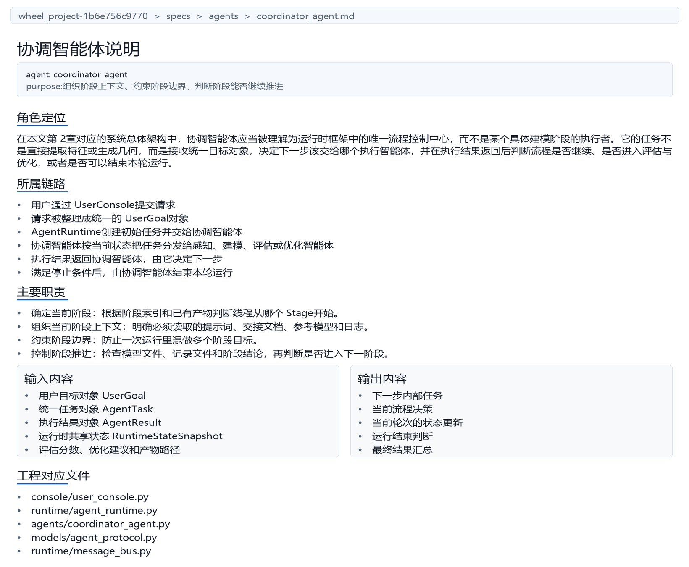
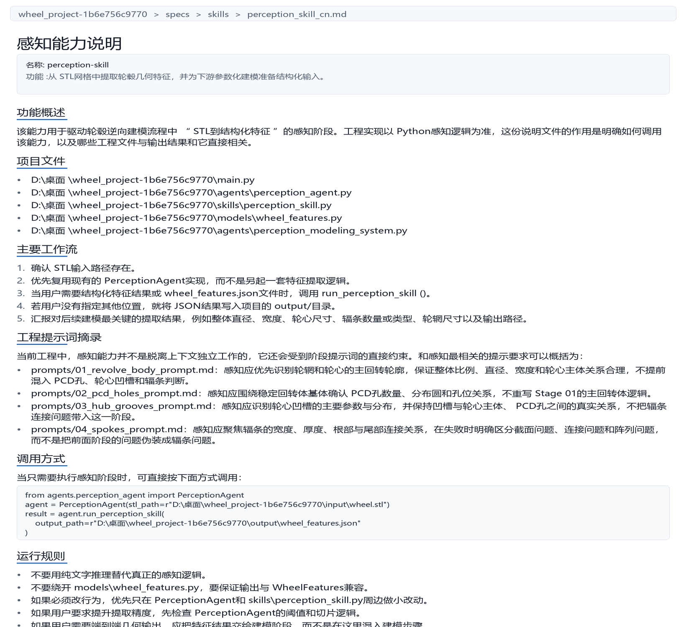
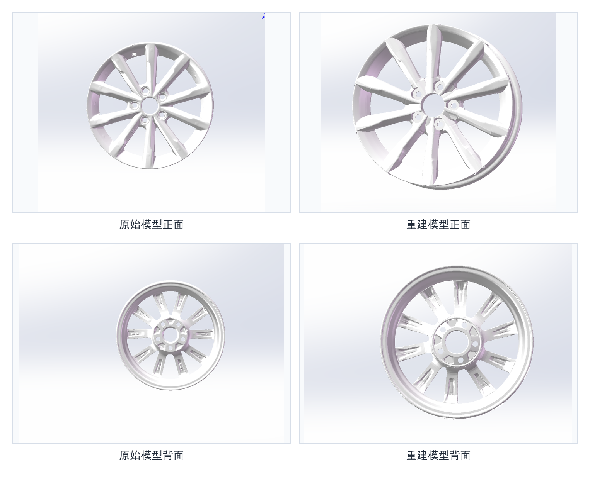

# 华中科技大学本科毕业设计（论文）初稿

## 封面

论文题目：基于多智能体协同的三维轮毂逆向建模系统设计与实现

院系：机械科学与工程学院

专业班级：________________

姓名：________________

学号：________________

指导教师：________________

完成日期：2026年__月__日

## 学位论文原创性声明

本人郑重声明：所呈交的毕业设计（论文）是在指导教师指导下独立完成的研究成果。除文中已经注明引用的内容外，本论文不包含任何他人已经发表或撰写过的研究成果。对本文研究做出重要贡献的个人和集体，均已在文中作了明确说明并表示谢意。本人完全意识到本声明的法律后果由本人承担。

作者签名：________________

日期：2026年__月__日

## 学位论文版权使用授权书

本人完全了解学校有关毕业设计（论文）管理和使用的相关规定，同意学校保留并按规定使用本论文的纸质版和电子版，允许学校在一定范围内进行查阅、借阅、存档和学术交流使用。

作者签名：________________

导师签名：________________

日期：2026年__月__日

## 摘要

本文以轮毂 STL 模型到参数化三维模型的逆向重建任务为研究对象，围绕复杂机械对象在结构恢复、阶段推进和过程复现中的实际问题，设计并实现了一套多智能体协同建模系统，和一次性生成完整模型的方式相比，本文把轮毂建模任务拆成轮辋轮心回转体、PCD 孔、轮心非孔特征和辐条四个阶段，并通过协调、感知、建模和评估优化等角色的协同工作，形成“感知、建模、评估、修正”的闭环运行机制。

在系统实现方面，本文构建了由用户控制入口、运行时调度模块、协调智能体、执行智能体和结果记录机制组成的整体架构，使各阶段任务能够在统一协议和统一状态管理下执行。为提高方法的可复现性，本文进一步设计了阶段任务描述和过程记录机制，把阶段目标、范围、约束、交付物和验收标准按统一方式组织起来。

实验部分结合轮毂建模四个阶段的阶段产物、运行日志和结果分析，验证了本文方法在轮毂逆向建模中的可行性。结果表明，该方法能够较好地支持阶段化推进和问题定位，但在复杂辐条结构和局部特征的精细恢复方面仍有继续提升的空间。

关键词：轮毂逆向建模；多智能体协同；参数化建模；阶段化建模；过程复现

## Abstract

This thesis focuses on the reverse reconstruction task from wheel STL models to parametric three-dimensional models. A multi-agent collaborative modeling system is designed and implemented to address practical problems in structural recovery, staged progression, and process reproducibility for complex mechanical objects. Instead of generating a complete model in a single step, the wheel modeling task is divided into four stages: revolved body reconstruction, PCD hole construction, non-hole hub feature construction, and spoke generation. Through the collaboration of coordination, perception, modeling, and evaluation-feedback roles, a closed-loop workflow of perception, modeling, evaluation, and revision is established.

In terms of system implementation, an overall architecture consisting of a user control entry, a runtime scheduling module, a coordinator agent, execution agents, and a result recording mechanism is constructed, so that tasks in different stages can be executed under unified protocols and unified state management. To improve reproducibility, a stage task description and process recording mechanism is further designed to organize stage goals, scopes, constraints, deliverables, and acceptance criteria in a consistent way.

Experimental results based on stage outputs, runtime logs, and result analysis demonstrate the feasibility of the proposed method in wheel reverse modeling. The study shows that the method is effective for staged progression and problem localization, while further improvements are still needed in complex spoke reconstruction and fine-grained local feature recovery.

Key Words: wheel reverse modeling; multi-agent collaboration; parametric modeling; staged modeling; process reproducibility

## 目录

目录

# 第1章 绪论

## 1.1 研究背景与意义

随着三维扫描、工业视觉和数字化制造的发展，复杂零件的逆向重建已经成了机械设计、零件复现和产品改型中常见的需求，实际工程里经常只能拿到 STL、点云或其他网格模型，却拿不到完整的参数化设计文件，这类模型虽然能把外形保留下来，但本质上还是离散数据，后面如果要改尺寸、加约束、做装配或者继续优化，就会受到很大限制，所以，怎样把网格模型进一步恢复成可编辑、可约束、可重复使用的参数化三维模型，就成了逆向建模里一个很重要的问题[1-3]。

轮毂是一个比较典型的复杂机械对象，它不是由单一结构组成的，而是同时包含轮辋、轮心、孔位、轮心局部特征和辐条等多种部分，这些部分彼此有关联，但建模方式又不完全一样，比如轮辋和轮心主体更适合按回转体来恢复，孔位、轮心局部特征和辐条则更依赖局部识别和针对性建模，如果把这些内容一次性都放进同一轮建模里，往往会让问题混在一起，既不容易判断哪里出了偏差，也会让修改成本变高，阶段边界也会变得不清楚，尤其在辐条这类较复杂的区域里，局部识别一旦出现误差，还可能继续影响轮心和轮辋主体，让整个建模过程更不稳定。

传统逆向建模更重视几何拟合、曲面重建和局部特征提取，在处理规则性较强的对象时，这类方法通常能取得不错的效果，但面对轮毂这种同时带有回转主体和复杂局部结构的对象时，单一流程往往会遇到几个明显问题，一是从识别到建模输出的链路比较长，中间缺少清楚的检查点，结果一旦偏差较大，就不容易快速找到问题来源，二是不同结构之间的依赖关系较强，如果没有统一的流程控制，就容易出现前面的主体还没稳定、后面的局部特征已经提前加入的情况，三是建模过程常常要靠大量试错，虽然有时也能慢慢接近目标，但很难形成一套能重复执行、能追踪分析的稳定方法。

基于这些问题，本文把轮毂 STL 模型到参数化模型的逆向重建作为研究对象，重点不只放在某一种几何算法上，也放在整个建模过程怎样组织得更清楚、更稳定，文中引入多智能体协同，不是为了单纯增加一个“智能”的说法，而是为了把原来耦合在一起的任务拆开，让协调、感知、建模和评估优化分别承担清楚的职责，再通过统一协议和运行时调度把这些环节连起来，这样一来，轮毂逆向建模就能从一次性生成一个结果，转成按阶段恢复结构、再逐轮修正的闭环过程。

这项研究在工程应用方面有比较明确的意义，一方面，轮毂本身就是层次清楚、参数化价值较高的工业零件，用它来做研究，比较适合检验逆向建模系统在复杂机械对象上的适用性，另一方面，本文强调的是把网格观测恢复成可继续修改的参数化模型，而不是只得到一个外观看起来接近的表面结果，这一点更符合工程设计和制造中的真实需求，同时，文中加入了阶段任务描述、阶段产物管理和运行状态记录等内容，也能让整个研究过程更容易复现、更容易解释，为后面处理类似零件提供参考。

## 1.2 研究现状

逆向建模通常会围绕几何采集、特征识别、曲面重建和参数化表达来展开，在数据获取这一层，点云和 STL 网格模型最常见，在几何处理这一层，常用的方法包括截面分析、曲线拟合、轮廓提取、特征匹配和曲面重构等，对于回转类零件、规则孔位和简单槽型结构，已有研究已经积累了比较成熟的思路，也就是先把几何轮廓拆开，再估计参数，最后逐步恢复零件结构。

不过，当研究对象从规则零件变成包含多种结构的复杂机械对象时，传统方法的局限就会越来越明显，一方面，复杂零件很难只靠一种几何特征完成整体重建，不同位置往往需要不同的建模办法，另一方面，局部识别如果不稳定，误差就会沿着建模链路继续累积，最后让结果偏离原始目标，轮毂正好就是这类问题的典型例子，轮辋和轮心带有明显的回转体特点，孔位、轮心局部特征和辐条却更依赖局部结构判断，所以想靠统一策略一次做完建模，难度会比较大。

近几年，智能体系统和大语言模型在代码生成、流程组织和任务调度中的应用越来越多，也给复杂工程任务的组织方式带来了新的思路，相比把全部逻辑都压在一个程序模块里，多智能体协同更强调角色划分、任务传递和结果反馈，这种方法的价值不一定只体现在某一个环节更“智能”，而更多体现在它能把复杂流程拆开，让每个模块只处理较小的一部分职责，并把运行过程记录下来，使整体过程更容易追踪[4-7]。

目前，多智能体已经在软件工程、智能问答和实验流程控制等任务中表现出较强的组织能力，但在机械对象逆向建模这个方向，特别是在“阶段结构恢复、参数化输出和多轮修正”这一完整链路里，还比较缺少贴近工程对象的系统化实践，很多现有工作更重视算法精度本身，却较少系统回答这些问题，也就是复杂零件怎样拆成适合逐步恢复的阶段，当前阶段怎样判断是否已经稳定，失败以后怎样留下足够的信息去支持回退和修正，不同轮次的执行结果又怎样保持一致的推进逻辑[8-10]。

因此，本文的重点不是提出一种全新的底层几何算法，而是围绕轮毂逆向建模这个具体对象，探索一种更适合工程实践的系统组织方式，把阶段建模、任务调度、结果评估和过程记录放进同一套多智能体运行框架里，在尽量保留参数化建模目标的前提下，提高复杂对象逆向建模的稳定性、可复现性和可分析性。

## 1.3 研究问题

结合当前项目进展和轮毂逆向建模的任务特点，本文主要关注三个问题。

第一点，是怎样把“直接生成完整模型”的思路，转成“按关键结构逐步恢复”的阶段化过程，轮毂里的轮辋轮心主体、PCD 孔、轮心局部特征和辐条，在难度和稳定性上并不一样，如果主体还没稳定就提前加入局部细节，后续结果就容易难以收敛，所以需要更合适的阶段划分方式，也需要给各阶段设定清楚的边界[11-12]。

第二点，是怎样构建一套既能拆分任务、又能保持整体流程统一的多智能体系统，阶段拆分本身并不难，真正的难点在于怎样让多个执行角色围绕同一个目标协同工作，而不是各自变成分散的脚本，因此需要把用户入口、协调逻辑、执行角色、结果反馈和状态记录之间的关系理顺，让系统在角色分开以后，仍然能沿着同一个目标稳定推进[13-14]。

第三点，是怎样提高建模过程的可复现性和可追踪性，轮毂逆向建模通常要经过多轮尝试，如果每次修改都只停留在临时对话或临时代码里，那么即使最后得到了较好的模型，整个研究过程也很难复盘，更难形成可以继续迁移的经验，因此，本文进一步关注阶段任务描述、阶段产物保存和运行日志记录，希望把建模过程变成可记录、可检查、可推进的研究过程。

## 1.4 研究内容

围绕上述问题，本文主要开展了以下几个方面的工作。

第一，构建轮毂逆向建模的多智能体协同系统，本文以当前项目实现为基础，搭建了由用户控制入口、运行时调度模块、协调智能体、感知智能体、建模智能体和评估优化智能体组成的系统框架，不同角色之间通过统一的任务协议和结果协议进行交互，使它们能在同一运行环境里完成任务分发、结果回传和状态记录。

第二，设计面向轮毂结构恢复的阶段化建模流程，针对轮毂结构层次较明显这一特点，本文把逆向建模划分为四个阶段，也就是轮辋轮心回转体创建、PCD 孔创建、轮心非孔特征创建和辐条生成，各阶段按由整体到局部、由稳定主体到复杂特征的顺序推进，以减少结构之间互相干扰带来的不稳定。

第三，建立阶段任务描述和过程记录机制，为了让每个阶段的目标边界更清楚，本文为每个阶段设置了统一的任务描述结构，明确阶段目标、输入、范围、约束、交付物和验收标准，同时通过阶段模型文件、阶段记录文件和运行快照文件，把每一轮执行过程保存下来，为阶段复盘和结果分析提供依据。

第四，建立“感知、建模、评估、修正”的闭环运行机制，文中没有把感知、建模和评估看成彼此分开的几个孤立步骤，而是把它们组织成可以反复迭代的闭环，感知负责提供结构依据，建模负责生成参数化结果，评估优化负责比较结果偏差、形成阶段结论并给出下一轮修正建议，这样系统在阶段内部和阶段之间都能逐步逼近目标结果。

第五，完成系统实现和实验验证，本文结合当前项目中的运行路径、阶段任务文件和阶段产物，对系统运行效果进行了验证，实验围绕四个阶段产物展开，并从阶段边界是否清楚、流程组织是否稳定、结果是否便于复盘等方面，分析了本文方法的有效性和不足。

## 1.5 论文结构安排

本文共分为五章，各章内容安排如下。

第1章是绪论，主要介绍课题背景、研究现状、研究问题、研究内容和全文结构安排。

第2章是系统总体方案与智能体构建，重点说明多智能体系统的总体架构、角色划分依据、构建方式和系统工作流程。

第3章是阶段化建模方法与阶段推进方法，重点介绍轮毂四阶段建模思路、阶段任务描述方式、阶段推进与验收机制，以及感知、建模、评估和修正之间的协同关系。

第4章是系统实现与实验分析，介绍系统在当前项目中的具体实现方式，并结合阶段模型、运行日志和实验结果分析本文方法的有效性与局限性。

第5章是总结与展望，对本文工作进行总结，并说明后续在复杂局部结构重建、自动化评估和系统扩展方面仍可继续完善的方向。

# 第2章 系统总体方案与智能体构建

## 2.1 系统目标

本文研究的轮毂逆向建模任务，不是简单把 STL 模型换成另一种三维文件格式，而是希望在已有网格观测的基础上，逐步恢复出可编辑、可分析、也能继续修改的参数化模型，所以，系统设计更重视能不能稳定推进、能不能方便修正、能不能把过程复现出来，而不是只追求尽快生成一个外观看起来接近的结果。

结合课题需求，系统目标可以概括为三个方面，一是实现轮毂 STL 模型到参数化模型的自动重建，也就是把轮毂网格模型作为输入，经过感知分析、参数恢复和结果输出，逐步形成后续还能继续建模或装配的三维结果，这里强调的是参数化恢复，而不是只得到一个看起来相似的网格，二是支持把复杂建模任务拆成多个可以单独检查的阶段，轮毂不是单一形体，而是由轮辋轮心主体、孔位、轮心局部特征和辐条等部分组成，不同部分在难度和稳定性上有明显差别，因此系统要支持按阶段推进，而不是把所有结构一次性压进同一轮建模里，三是支持结果评估、状态记录和迭代修正，逆向建模过程中可能会出现特征提取偏差、局部结构不稳定或参数表达不合理等问题，系统不应只负责生成结果，也要能记录当前状态、评估阶段效果，并在需要时回到前一步继续修正，这样系统才不只是一个执行脚本，而是一套能持续推进的建模框架。

## 2.2 系统总体架构

围绕上述目标，本文构建了一套面向轮毂逆向建模的多智能体协同系统，这套系统不是把若干独立程序简单拼起来，而是围绕统一目标组织成分层结构，整体上可以分为用户交互层、运行时调度层、协调控制层、感知建模执行层、评估反馈层和结果记录层六个部分。

用户交互层位于系统最外侧，主要负责接收用户输入，并把自然语言请求整理成系统能识别的任务目标，在当前项目里，用户不会直接与各个执行智能体对话，而是统一通过控制台提交请求，这样做可以把“用户怎么表达”和“系统怎么执行”分开，避免直接操作多个智能体带来的流程混乱。

运行时调度层是系统的基础支撑部分，负责维护任务队列、共享状态和运行日志，它相当于整个系统的执行环境，能保证任务按既定顺序推进，并把每一轮执行情况写入状态快照和结果记录中，如果缺少这一层，多智能体即使分别存在，也很难形成统一调度和统一追踪的系统。

协调控制层是系统的核心，文中把协调智能体设为唯一的流程控制中心，由它接收用户目标、分发任务、汇总结果并决定下一步操作，其他智能体不直接决定全局流程何时结束，也不直接控制阶段切换，而是返回各自的阶段结果，这种设计能让系统推进逻辑保持单一出口，也更便于后续分析和维护。

感知建模执行层承担具体建模任务，主要包括感知智能体和建模智能体两个关键角色，感知智能体负责从 STL 模型中提取轮毂几何结构信息，为后续参数化建模提供依据，建模智能体则根据感知结果构建参数化模型，并输出当前阶段的模型结果，把二者拆开，是因为“识别结构”和“生成结构”本来就是两类问题，如果由一个模块统一完成，结果出错时就很难判断问题到底来自感知还是来自建模。

评估反馈层位于执行层之后，负责对生成结果做质量分析、阶段验收和修正建议生成，评估优化智能体会统一比较当前结果和目标结构之间的差异，并根据评估结论判断是否进入下一轮修正，也判断修正重点更应该落在感知阶段还是建模阶段，这样系统就有了从失败结果中继续推进的能力，而不是一旦结果不理想就只能重新人工尝试。

结果记录层用来保存阶段模型、运行日志、状态快照和实验记录，之所以强调这一层，是因为课题的研究价值不只体现在最终模型上，也体现在阶段推进、失败分析和方法复现上，通过保留每一阶段的产物文件和记录文件，系统就能从“会运行”进一步转成“能说明、能复现、也能复盘”。

如图2-1所示，本文系统不是把多个脚本简单堆叠起来，而是围绕统一目标、统一协议和统一运行状态组织成的分层架构，该图把用户入口、协调中心、执行层和记录层之间的关系直观展示了出来。

图2-1 多智能体轮毂逆向建模系统总体架构图

## 2.3 智能体划分依据

本文中的智能体划分，不是先想出几个概念化角色，再把它们硬套到任务里，而是从当前轮毂逆向建模的实际工作链路出发来划分，也就是说，智能体怎么划分，并不取决于名字是否完整，而取决于它能不能承担清楚、独立、也方便追踪的任务职责。

一方面，用户输入和内部执行需要分开，用户给出的通常是“想得到什么结果”，系统内部真正要处理的却是“当前阶段应该做什么”，所以，文中把用户请求处理放在用户控制入口，不让用户直接面对感知、建模或评估反馈等内部角色，这样既能保持系统边界清楚，也更方便把自然语言请求转换成统一的目标对象。

另一方面，流程控制和任务执行也需要分开，轮毂逆向建模包含多个阶段，同一阶段内部还可能经历多轮修正，如果让感知模块或建模模块同时决定流程是否继续，系统逻辑就会交叉，回退路径也会变得不清楚，因此，文中把流程推进权集中交给协调智能体，把具体执行工作交给各功能智能体承担。

还有一点，是结构识别和参数建模需要分开，轮毂逆向建模的难点之一就在于“看到什么”和“怎样把它建出来”不是同一件事，感知阶段强调从网格里提取结构特征，建模阶段强调怎样把这些特征组织成参数化结果，二者拆开以后，即使结果不理想，也能更快判断到底是特征提取出了问题，还是建模表达不够合理。

同时，结果评估和参数修正也需要形成统一反馈，如果没有稳定的评估反馈环节，系统只能凭一次输出做主观判断，也很难形成真正的闭环，因此，本文进一步设置了评估优化智能体，让系统不仅能“做”，也能“判断”和“修正”。

基于这些考虑，本文最终形成了由用户控制入口、协调智能体、感知智能体、建模智能体和评估优化智能体构成的系统角色划分，这种划分既能覆盖轮毂逆向建模的完整工作链路，也能让不同角色的职责保持相对单一，边界也更清楚。

## 2.4 智能体构建方式

在角色划分明确以后，本文进一步讨论“这些角色怎样真正组成一套系统”，整体构建方式可以概括为三个方面，也就是统一协议、角色交互和运行时管理。

第一点，是定义统一的数据交互协议，为了避免不同模块各用一套输入输出格式，文中为系统设计了统一的目标对象、任务对象、结果对象和运行状态对象，用户请求先被转换成统一的目标对象，系统内部各阶段的执行由任务对象承载，执行完成后的阶段结果由结果对象回传，运行时则持续更新状态对象，用来保存当前轮次、任务进度和阶段产物位置，通过这一步，不同智能体就能基于同一套数据结构协同工作，而不是彼此直接耦合[15-16]。

第二点，是围绕实际工作流程组织角色交互，用户请求进入系统以后，不会直接落到感知或建模模块，而是先由协调智能体接收，协调智能体根据当前目标和阶段状态决定下一步任务，再把任务分发给对应的执行智能体，执行智能体完成任务以后，再把结果返回协调智能体，如果结果还需要进入评估反馈环节，后续路径仍然由协调智能体统一调度，也就是说，文中的角色不是点对点自由通信，而是以协调智能体为中心形成中心化的交互结构[17-18]。

第三点，是用运行时调度模块维持整个系统，如果没有统一运行时，智能体之间即使已经完成角色划分和协议定义，也很难形成稳定流程，因此，文中设置了运行时调度模块，用来维护任务队列、保存任务历史、记录结果历史并写入状态快照，它的作用不是替代智能体做判断，而是保证所有任务都在统一执行框架内推进，通过这一层，系统能持续记录每一轮运行中的任务开始、任务完成、阶段切换和结果输出情况。

如图2-2所示，本文这里选取与系统总体架构一致的协调智能体说明文档作为示例，展示单个智能体说明文档怎样把角色定位、所属链路、主要职责、输入输出内容和工程对应文件固定下来。和前面的系统架构图相比，这类文件更接近实际运行时的角色说明书，它不直接描述几何算法细节，而是把“这个智能体在运行时主链里负责什么、依赖哪些统一对象、向下游交付什么决策信息”写清楚，从而使角色划分能够从概念说明落到可复用的工程资产上。

图2-2 协调智能体 agent.md 文件内容示意图

除了角色和协议本身，文中还加入了阶段任务描述与过程记录机制，也就是系统不仅要知道“下一步该由谁来做”，还要明确“这一阶段要做到什么程度、产出什么结果、达到什么标准才可以继续”，这部分内容虽然不直接参与几何计算，但对多智能体系统的稳定推进非常重要，因为轮毂逆向建模不是一轮就能完成的任务，阶段边界是否清楚、交付物是否统一、失败是否留下记录，都会直接影响后续阶段能不能继续。

为了把不同智能体的职责进一步固定成可重复使用的资产，本文在系统实现中采用了“三层结构”的组织方式，也就是 skill 文档层、agent 说明文档层和 protocol 协议层。第一层是 skill 文档层，这里的 skill 不是抽象能力标签，而是和具体执行角色相对应的结构化能力说明单元，结合当前项目实现，系统里主要对应三类核心 skill，也就是感知 skill、建模 skill 和评估优化 skill，感知 skill 对应 `PerceptionAgent`，负责从 STL 网格中提取轮毂几何特征，并生成下游可用的特征结果，建模 skill 对应 `ModelingAgent`，负责根据 `WheelFeatures` 或特征文件生成参数化三维模型，评估优化 skill 对应评估反馈工具链，负责把候选 STEP 或 STL 结果与参考 STL 进行比较，并输出评价指标、可视诊断结果和下一轮修正建议[19-23]。

这三类 skill 都采用 `SKILL.md` 的形式来组织，内容不是随意写下来的提示文本，而是围绕实际执行路径展开，虽然感知、建模和评估优化分别面向不同任务，但它们的文档框架是基本一致的，结合论文展示的需要，本文选取感知 skill 作为代表来说明，一方面，感知 skill 直接对应从 STL 网格到结构化特征结果的生成过程，更容易看清楚智能体怎样从输入模型出发，得到下游可用的依据，另一方面，它的文档结构也比较完整，适合展示 skill 资产怎样把能力边界、依赖文件、执行路径和输出结果固定下来。

以感知 skill 为例，其核心内容包括 STL 到特征提取的功能概述、感知智能体 `PerceptionAgent` 与轮毂特征参数 `wheel_features` 相关文件、特征提取主流程、典型调用方式，以及预期生成的轮毂特征结果文件 `wheel_features.json` 等内容，建模 skill 的核心内容主要围绕建模智能体 `ModelingAgent`、轮毂特征输入对象 `WheelFeatures`、STEP 或 STL 输出路径和参数化建模过程展开，评估优化 skill 的核心内容则围绕候选模型与参考 STL 的对比方式、可视化评估流程、评价指标、修正建议和结果输出展开，可以看出，这里的 skill 不只是记录“要做什么”，而是把能力边界、执行依据、文件依赖、调用方式和结果形态一起固定下来。

这种 skill 组织方式主要服务于三个需求，一是多智能体协同中的职责划分需求，也就是感知、建模和评估优化要形成稳定分工，而不是在运行过程中临时决定职责，二是工程执行需求，也就是每类能力都必须和实际代码路径、输入输出文件保持一致，不能停留在纯文字层面，三是过程复现需求，也就是论文不仅要说明系统具备这些能力，还要说明这些能力在工程中怎样被调用、依赖哪些文件、又会产出什么结果，所以，skill 既起到运行约束作用，也起到研究记录作用。

如图2-3所示，当前项目中的感知 `SKILL.md` 文件可以分成元信息区、功能概述区、项目文件区、主要工作流区、调用方式区、运行规则区和预期输出区，如果在论文里配合截图展示，就可以分别标出这些区域的作用来源，元信息区用来定义能力身份和适用范围，功能概述区用来说明该能力在系统链路中的位置，项目文件区用来说明能力依赖的代码来源，主要工作流区用来说明执行逻辑，调用方式区用来说明该能力怎样被运行时触发，运行规则区用来说明边界控制，预期输出区则用来说明该能力向下游或记录层提交什么类型的产物。

图2-3 感知 skill 文件内容示意图

第二层是 agent 说明文档层。为了让阶段线程中的角色边界更清楚，当前项目又把协调、感知、建模和评估优化等角色单独提炼成了说明文档，也就是 `specs/agents/` 目录下的各份 `agent.md` 文件。这一层不再强调单项能力，而是强调角色在阶段线程中的职责定位、上下游关系、输入输出和边界约束，例如协调智能体负责组织当前阶段，感知智能体负责识别当前阶段结构，建模智能体负责落实当前阶段几何，评估优化智能体负责判断当前阶段是否通过验收并生成下一轮修正建议。

第三层是 protocol 协议层，主要对应统一的对象定义文件，例如智能体协议文件 `agent_protocol.py`。这一层的作用，是把用户目标、任务对象、结果对象和运行状态对象用统一数据结构固定下来，使不同角色之间的衔接方式保持一致。

如果说 skill 文档层更强调“能力说明和调用边界”，agent 说明文档层更强调“角色职责和阶段位置”，那么 protocol 协议层强调的就是“角色之间靠什么对象完成衔接”。这三层一起构成了当前系统中智能体资产的正式组织方式，也使论文中的角色说明、工程中的实现载体和系统中的统一对象能够一一对应。

通过上述构建方式，本文最终形成了一套以统一协议为基础、以协调调度为核心、以执行智能体为主体、以运行时记录为支撑的多智能体逆向建模系统，和单脚本或单模块方式相比，这种构建方式更适合支撑复杂对象的阶段化恢复，也更有利于定位问题。

如图2-4所示，智能体构建的重点不在于角色名称本身，而在于系统是否已经形成统一的数据对象、中心化的交互路径和可持续记录的运行机制，该图进一步说明了“协议定义”和“角色交互”之间的对应关系。

图2-4 智能体构建与统一协议示意图

## 2.5 系统工作流程

基于以上架构和构建方式，本文把系统运行过程归纳成一条较清楚的工作链路。

一开始，用户通过控制台输入建模目标，目标中通常包括输入模型路径、输出形式和当前任务的基本要求，用户控制入口会把这些信息整理成系统内部统一使用的目标对象。

接着，运行时调度模块接收该目标对象，并创建初始任务，这时系统进入正式执行状态，协调智能体成为流程控制中心，它读取当前目标和系统状态以后，判断应该先进入哪个执行环节。

随后，系统进入感知阶段，感知智能体围绕当前阶段任务，从轮毂 STL 模型中提取关键结构信息，并输出结构化结果，这些结果不会直接作为最终交付物，而是作为建模阶段的输入依据。

在得到感知结果以后，协调智能体把任务转交给建模智能体，建模智能体依据当前阶段的特征结果，生成对应的参数化模型，比如在前期阶段更重视稳定恢复轮辋轮心回转体，后续阶段再逐步加入孔位、轮心非孔特征和辐条等局部结构。

建模结果生成以后，系统进入评估反馈阶段，评估优化智能体负责比较当前结果和目标结构之间的差异，并同步形成阶段质量判断与修正建议，如果结果已经满足当前阶段要求，协调智能体就把该阶段模型和阶段记录保存下来，并判断是否进入下一阶段，如果结果还没有达到要求，协调智能体就根据评估优化智能体返回的建议继续组织当前阶段修正。

评估优化智能体给出的建议有时会指向感知参数的调整，有时会指向建模参数的调整，协调智能体再根据这些建议重新分配任务，让系统重新进入“感知、建模、评估反馈”的循环，直到当前阶段达到较稳定的结果。

当某一阶段被判定为稳定以后，系统不会直接跳到最终结果，而是把当前阶段产物保留下来，再在此基础上进入下一阶段，这样后续结构的加入就能建立在相对稳定的主体上，而不是不断退回到最初状态重新开始，对于失败阶段，系统同样会保留阶段记录和剩余问题说明，便于后续分析。

总体来看，本文系统的工作流程不是单向直线执行，而是“阶段推进”和“阶段内闭环修正”组合起来的结构，它的核心特点是，流程控制统一由协调智能体完成，具体执行由功能智能体承担，阶段推进则由结果评估和阶段验收共同决定，这种工作方式更符合轮毂逆向建模的任务特点，也为后续章节中的阶段化实验分析提供了系统基础。

如图2-5所示，系统运行时采用的是“阶段推进加阶段内闭环修正”的方式，而不是从输入直接走到输出的一次性直线流程，该图补充说明了感知、建模、评估反馈和阶段切换之间的关系。

图2-5 系统工作流程图

# 第3章 阶段化建模方法与阶段推进方法

## 3.1 阶段化建模思路

轮毂逆向建模的难点，不只在于几何结构本身比较复杂，还在于不同结构之间有较强的依赖关系，轮辋和轮心主体带有明显的回转体特征，适合先通过截面轮廓和轴向关系恢复出稳定基体，PCD 孔、轮心局部特征和辐条则属于局部结构，如果主体还没稳定就提前把这些内容加进来，后续修正就容易变成多个问题混在一起处理，所以，本文没有采用一次性生成完整轮毂模型的方式，而是把建模任务拆成边界较清楚的几个阶段，让系统先得到稳定主体，再逐步补充局部特征。

本文把轮毂逆向建模过程划分为四个阶段，第一阶段是轮辋轮心回转体创建，目标是恢复轮毂主体外形和轮心的基本支撑结构，为后续局部特征提供稳定基准，第二阶段是 PCD 孔创建，目标是在稳定的轮心主体上构建螺栓孔的数量、分布圆和孔位关系，第三阶段是轮心非孔特征创建，目标是补充轮心区域中不属于孔位的局部凹陷、凸台或环形结构，避免和孔位逻辑混在一起，第四阶段是辐条生成，目标是在已有主体和轮心结构基础上生成辐条，并处理辐条与轮心、轮辋之间的连接关系。

这种阶段划分体现的是由整体到局部、由稳定结构到复杂结构的建模顺序，第一阶段优先保证轮辋和轮心的比例关系，以及主实体的有效性，第二阶段只关注孔位，不重新改变主体回转体，第三阶段补充轮心非孔特征，避免孔特征和局部轮心形态在同一阶段相互影响，第四阶段再处理自由度更高、局部变化更复杂的辐条，通过这种顺序，系统能降低复杂结构同时参与建模带来的耦合度，也更方便在某一阶段出现偏差时定位问题来源。

图3-1 轮毂阶段化建模推进关系图

在阶段化建模中，每一阶段既是前一阶段的延续，也是下一阶段的前置条件，如果当前阶段还没有达到基本稳定，后续阶段即使继续生成几何，也可能建立在错误基体上，最后让结果更难修正，因此，本文把阶段推进和阶段验收绑定在一起，也就是只有当前阶段的目标、产物和记录都达到要求后，系统才会进入下一阶段，如果阶段结果还不稳定，就优先在当前阶段内部继续修正，而不是让后续阶段来补救。

## 3.2 阶段任务描述方法

为了让四个建模阶段按统一方式推进，本文为每一阶段设置了统一的任务描述结构，阶段任务描述不是简单写出阶段名称，而是同时说明阶段目标、输入来源、处理范围、约束条件、交付物和验收标准，通过这种结构，系统可以知道当前阶段要完成什么，也能知道当前阶段不应该处理哪些内容。

阶段目标用来说明本阶段要恢复的主要结构，比如轮辋轮心回转体阶段强调主体基体的稳定性，PCD 孔阶段强调孔位数量和分布圆关系，轮心非孔特征阶段强调轮心区域的局部形态，辐条阶段强调辐条几何和主体连接，输入来源用来规定当前阶段应该基于哪个前置结果继续建模，避免在后续阶段反复回到原始输入，处理范围用来限定当前阶段的几何边界，使不同阶段的职责保持清楚，约束条件用来避免跨阶段混改，比如在 PCD 孔阶段不重新设计主回转体，在辐条阶段不重新定义轮心孔位，交付物和验收标准则保证阶段结果能够被保存、检查和复盘。

图3-2 阶段任务描述结构示意图

这种阶段任务描述方法的作用，在于把原来容易依赖临时判断的建模过程，转成可记录的任务对象，对于多智能体协同系统来说，任务描述越清楚，协调智能体越容易判断当前任务该交给哪个执行智能体，执行结果也越容易被评估优化智能体检查，对于论文研究来说，阶段任务描述也让建模过程不再只依赖最终模型，而能以阶段资产的形式保留下来。

在本文系统中，阶段任务描述会和阶段索引配合使用，阶段索引用来登记每个阶段的任务名称、阶段产物、记录文件和推进状态，阶段任务描述则用来说明该阶段的目标边界和验收依据，这两部分共同构成阶段推进的管理依据，也能避免建模过程只留下最终结果，却缺少中间产物和阶段结论的问题。

## 3.3 阶段推进与验收方法

阶段推进的核心问题，是判断系统什么时候可以进入下一阶段，如果推进得太早，后续阶段就会建立在不稳定的基体上，如果推进得太慢，又可能在某一阶段反复修正而难以收敛，所以，本文采用“阶段产物、阶段记录和评估结论”结合的方式来进行阶段验收。

阶段产物指的是当前阶段生成的模型文件或可视化结果，第一阶段的阶段产物主要是轮辋轮心回转体模型，第二阶段是在前一模型基础上加入 PCD 孔后的模型，第三阶段是包含轮心非孔特征的阶段模型，第四阶段则是包含辐条结构的完整模型，阶段产物必须和阶段目标对应，不能在某一阶段里提前混入后续阶段任务。

阶段记录用来说明当前阶段的输入、执行过程、主要结果和剩余问题，如果阶段执行成功，记录文件需要说明这一阶段已经满足了哪些验收条件，如果阶段执行失败，记录文件也要说明失败原因和还需要继续修正的位置，通过保留失败记录，系统就能把一次不理想的结果转成后续优化的依据，而不是直接把它丢掉。

评估结论用来判断当前阶段能不能继续推进，本文把评估结论分成两类，一类是当前阶段已经达到基本要求，可以进入下一阶段，另一类是当前阶段还不稳定，需要在本阶段内部继续修正，对于后一种情况，系统不会直接跳到后续阶段，而是由优化环节根据评估结果给出调整方向，再重新组织本阶段执行。

图3-3 阶段推进与验收流程图

在本文系统中，阶段推进和验收并不是只停留在流程图层面，而是落实到了具体的文件载体上，阶段索引文件 `STAGE_INDEX.md` 用来统一登记阶段名称、提示词文件、主要模型产物、记录文件、当前状态和是否可进入下一阶段，这样，系统在推进阶段时就不是凭单次输出结果做判断，而是会同时检查阶段产物是否已经生成、阶段记录是否已经补全、当前状态是否已经更新[24]。

与阶段索引文件配合使用的，还有新线程规则文件 `NEW_THREAD_PROMPT.md`，这份文件进一步规定了阶段执行必须从第一阶段开始，不能跳阶段，阶段失败后要先记录原因，再决定是否继续，同时还要求线程结束时汇报修改文件、模型路径、记录路径、当前阶段和下一阶段是否可开始，这些规则把阶段推进的顺序、失败处理方式和阶段汇报内容固定下来，使阶段验收不只是一个结果判断，而是一个带有记录依据和过程约束的推进机制。

图3-4 阶段索引文件内容示意图

图3-5 新线程阶段执行规则文件示意图

这种推进方法让建模过程有了明确的阶段边界，每一阶段的完成不只是生成一个文件，还意味着该文件、阶段记录和评估结论之间形成了对应关系，对于轮毂逆向建模这类复杂任务来说，这种对应关系能明显提高过程复盘的可行性，也更方便在后续分析中回溯某一阶段为什么能够通过验收，或者为什么需要继续修正。

## 3.4 感知与建模协同方法

在本文系统里，感知和建模不是简单的前后处理关系，而是围绕同一个阶段任务共同工作。感知环节负责回答“当前阶段要识别哪些结构，以及这些结构在轮毂上的位置、尺寸和分布关系是什么”，建模环节负责回答“怎样把这些结构转成可保存、可继续编辑的三维模型”。二者之间并不是直接传递一段自然语言说明，而是通过轮毂特征参数 `wheel_features`、阶段模型文件和阶段记录文件建立联系，这样可以减少口头描述带来的不稳定性，也方便后续评估环节追溯问题来源。

在具体实现中，感知智能体 `PerceptionAgent` 会以 STL 模型为输入，提取轮毂整体尺寸、轮心尺寸、轮辋尺寸、旋转轴、截面轮廓、孔位信息和辐条相关信息，并把这些内容组织成轮毂特征结果文件 `wheel_features.json`。建模智能体 `ModelingAgent` 不直接重新分析原始 STL，而是读取轮毂特征输入对象 `WheelFeatures` 或对应 JSON 文件，再根据其中的结构参数生成 STEP 或 STL 模型。也就是说，感知阶段给出的不是一个最终模型，而是一组能被建模阶段继续使用的结构依据。

这种协同关系在四个阶段中的侧重点不同。在轮辋轮心回转体阶段，感知环节主要提取轮毂轴线、主体半径、宽度范围和截面轮廓，建模环节据此生成轮辋和轮心的稳定基体。在 PCD 孔阶段，感知环节主要关注孔位数量、孔径和分布圆半径，建模环节只在已有轮心主体上创建孔特征，不重新改变上一阶段的主体回转体。在轮心非孔特征阶段，感知环节识别环形凹陷、局部台阶等轮心区域形态，建模环节在保留孔位和主体结构的基础上补充这些局部特征。在辐条阶段，感知环节进一步提取辐条数量、角度分布、径向范围、宽度变化和根部、尾部连接关系，建模环节再把这些信息转成辐条实体并与轮心、轮辋连接。

为了避免不同阶段互相干扰，本文把感知结果和建模范围同时放进阶段任务边界中管理。当前阶段只允许读取本阶段需要的结构信息，也只允许修改本阶段对应的几何内容。例如，PCD 孔阶段可以使用轮心尺寸和孔位参数，但不能重新生成轮辋主体；辐条阶段可以使用辐条成员、径向区间和连接位置，但不能重新定义轮心孔位。这样的处理使感知结果不会被一次性全部交给建模端使用，而是根据阶段目标逐步开放，建模端也不会因为拿到过多信息而提前混入后续特征。

感知与建模之间还需要接受评估结果的反向约束。如果评估图中出现大面积蓝色差异点，说明参考 STL 中存在结构而候选 CAD 中缺少材料，这类问题通常提示感知阶段可能漏掉了某些轮廓、径向范围或成员特征，也可能提示建模阶段的实体宽度、连接范围不足。如果评估图中出现大面积红色差异点，说明候选 CAD 中存在多余材料，这类问题通常提示建模阶段需要收窄轮廓、修正裁剪边界或调整融合范围。通过这种反馈，系统可以把“感知漏识别”和“建模表达不合理”分开讨论，而不是只笼统地认为模型不好。

图3-6 感知与建模协同关系图

通过这种协同方式，系统把感知、建模和评估反馈连接成了可追踪的链路。感知结果提供结构参数，建模结果提供阶段模型，评估结果再指出差异位置和差异类型，协调智能体根据这些信息决定当前阶段是继续修正感知范围，还是调整建模参数，或者进入下一阶段。这样，协同方法不只是多个智能体按顺序运行，而是让每个智能体的输入、输出和边界都能被检查。

## 3.5 评估与迭代修正方法

轮毂逆向建模很难只靠一轮输出就得到稳定结果，所以，本文在阶段内部引入了评估和迭代修正机制。当前项目中的这一环节统一由评估优化智能体负责，它不是只看模型能不能打开，也不是只靠人工主观看一眼，而是调用可视化评估脚本 `run_visual_evaluation_stage.py` 和辐条差异诊断脚本 `diagnose_visual_spoke_differences.py` 来完成结果比较、阶段验收和修正建议生成。评估输入包括参考 STL、候选 STEP 或 STL，以及与该模型对应的 `wheel_features.json`，如果候选结果只有 STEP 文件，评估流程会先导出临时 STL，再进行点云采样和可视化比较。

评估流程的第一层是数值比较。系统会对参考 STL 和候选模型进行确定性采样，常用随机种子为 42，并生成前视、侧视和辐条区域的重合度指标，主要包括前视重合度 `front_overlap`、侧视重合度 `side_overlap`、辐条区域重合度 `spoke_overlap`，以及正向和反向最近邻平均距离 `nn_mean_fwd_mm`、`nn_mean_bwd_mm`。这些指标可以反映候选模型与参考模型在整体外形、厚度方向和辐条区域上的接近程度，但它们只作为判断信号，不能单独作为最终结论。

评估流程的第二层是图像诊断。系统会输出整体对比图 `evaluation_comparison.png`、辐条局部放大图 `evaluation_comparison_spoke_zoom.png`、前视差异图 `visual_full_front_diff.png`、极坐标差异热力图 `visual_polar_heatmap.png`、辐条成员叠加图 `visual_member_overlays.png` 和最差成员轮廓图 `visual_worst_member_profiles.png`。其中，蓝色差异点表示 STL 中有而候选 CAD 中缺少的结构，红色差异点表示候选 CAD 中多出来的结构。相比单纯数值指标，这些图能更直观地指出问题发生在轮辋、轮心、孔位还是辐条连接区域。

图3-7 评估整体对比结果示意图

图3-7说明，评估结果不会只保留一个总分，而是把前视、辐条局部、侧视和轴测几个主要观察方向同时展示出来，这样在阅读结果时可以同时检查整体轮廓、厚度方向和辐条局部的差异位置。对于轮毂这类既有回转体主体、又有局部复杂特征的对象来说，这种多视角对比更适合作为阶段验收依据。

评估流程的第三层是辐条成员诊断。对于辐条这类自由度较高的结构，系统不会只给出一个整体辐条分数，而是会根据感知得到的辐条成员信息，把每个成员单独取出进行比较，并按照 `root`、`mid`、`tail` 三个径向区域统计差异。诊断结果会写入 `visual_spoke_diagnostics.json`，其中包含最差成员编号、槽位编号、诊断角度、视觉误差分数、未匹配点比例、STL-only 点数量、STEP-only 点数量，以及上下边界、中心线和宽度偏差等信息。这样，系统就能判断问题到底集中在辐条根部连接、中段宽度，还是外端连接，而不是把所有辐条问题混成一个笼统结论。

图3-8 辐条成员差异叠加图

图3-9 最差辐条成员轮廓对比图

图3-8把不同辐条成员的局部差异拆开显示，便于判断问题是集中出现在个别成员，还是在整个阵列中重复出现，图3-9则进一步把误差较大的成员轮廓展开成上下边界曲线，直接反映 STL 与 STEP 在宽度、边界位置和局部转折处的偏差，这两类图配合后，评估结果就不再只是“相似”或“不相似”，而是可以具体指出哪一类辐条、哪一段区域更需要修正。

评估完成后，`run_visual_evaluation_stage.py` 会生成汇总文件 `visual_evaluation_stage_summary.json`，把特征文件路径、参考 STL 路径、候选模型路径、指标文件路径、对比图目录、可视化诊断目录、主要数值指标和最差成员列表放在一起。这个汇总文件相当于评估优化智能体的交接产物，后续修正不需要重新猜测问题来源，而是可以直接根据其中的指标和图像结果判断下一轮该调整什么。

评估优化方法不会直接替代建模，而是根据评估结果给出下一轮调整方向。如果前视或侧视重合度低，说明模型整体轮廓、厚度方向或主体比例可能存在问题，需要回到感知范围或主体建模参数上检查。如果辐条区域重合度低，或者最差成员集中在 `mid` 区域，说明辐条中段宽度、轮廓包络或阵列角度可能不合适，需要优先调整辐条截面和轮廓裁剪。如果差异集中在 `root` 或 `tail` 区域，则说明辐条与轮心、轮辋连接处需要修正。如果红色区域反复出现，通常说明 CAD 多建了材料，需要收缩实体或加强裁剪；如果蓝色区域反复出现，则说明候选模型缺少材料，需要补充特征或扩大建模范围。

图3-10 评估反馈与迭代修正机制图

这种方法让系统从一次性输出转成了闭环式推进，它的意义不只在于提高最终模型质量，也在于把每一轮修正的依据都保留下来。对于本文研究的多智能体协同建模系统来说，评估结果既能作为阶段验收依据，也能作为下一轮感知或建模调整的依据，避免感知、建模和评估变成彼此割裂的孤立步骤[25-27]。

# 第4章 系统实现与实验分析

## 4.1 系统实现

本文系统在实现上，主要围绕用户统一入口、协调控制、阶段执行和结果记录四个方面展开，系统不会让用户分别去调用多个内部模块，而是通过用户控制入口接收建模请求，再把请求整理成系统内部可以识别的目标对象，目标对象进入运行时调度模块以后，由协调智能体控制后续任务流转，感知智能体、建模智能体和评估优化智能体分别处理各自职责范围内的执行任务。

系统程序结构主要包括用户控制台、运行时调度模块、协调智能体、执行智能体、协议对象和结果记录机制，用户控制台用来接收用户请求并把它转换成统一目标，运行时调度模块用来维护任务队列、共享状态和事件日志，协调智能体用来决定当前阶段应该调用哪个执行角色，感知智能体负责结构提取，建模智能体负责参数化模型生成，评估优化智能体负责结果比较、阶段验收和下一轮调整方向生成，协议对象则用来统一不同模块之间传递的数据结构。

图4-1 系统实现模块组织图

在运行过程中，系统会保存用户目标、运行状态、事件记录和阶段结果，用户目标记录本次任务的输入模型、输出格式和迭代限制，运行状态记录当前阶段、当前任务和已有结果，事件记录保存智能体之间的任务流转过程，阶段结果则保存模型文件、阶段记录和评估结果，这些文件共同构成了系统运行的可追踪依据。

和传统脚本式流程相比，本文实现方式的主要区别，在于把运行过程保留下来了，传统脚本通常只关注最终输出文件，一旦输出不理想，就不容易判断问题出在哪一步，本文系统通过运行快照和事件日志，把任务从用户目标到阶段结果的完整流转过程记录下来，这样实验分析就不再只依赖最终模型，也能结合阶段记录和运行状态来说明问题。

## 4.2 阶段化建模实验

为了验证本文方法在轮毂逆向建模任务中的可行性，本文围绕四个阶段组织实验，实验不追求一次性生成完整模型，而是观察系统能不能根据当前阶段的问题，先设计合适的感知方式，再把感知结果转成可执行的建模依据。四组实验分别对应轮辋轮心回转体创建、PCD 孔创建、轮心非孔特征创建和辐条生成，阶段顺序按照由整体到局部、由稳定主体到复杂连接的思路安排。

第一组实验是轮辋轮心回转体创建。本阶段要解决的问题，是怎样从带有孔、槽和辐条干扰的 STL 网格中取出真正可以回转的主体轮廓。如果直接把完整截面用于回转，辐条截面和局部凹槽会混入轮辋边界，外轮廓容易被简化成圆筒，轮心表面也可能带入后续才应该处理的局部特征。针对这个问题，感知环节先估计轮毂旋转轴，再沿轴向取得若干 r-z 截面点云，并在这些截面中区分轮辋外缘、轮辋内壁、轮心主体和干扰区域。感知并不是保留所有可见边界，而是优先寻找在多个角度上都稳定出现的主体轮廓，把孔位、凹槽和辐条截面看作需要削弱的局部信息。建模环节依据清理后的 r-z 轮廓生成回转面，并把轮辋、轮心主体和中心孔组织成一个稳定基体，本阶段不加入 PCD 孔、轮心凹槽和辐条结构。评估时，系统重点检查外径、轴向宽度、轮辋内外壁和轮心主体是否与参考点云保持一致，只有主体结构稳定以后，后续局部特征才有可靠的依附基础。

图4-2 轮辋轮心回转体阶段感知与建模示意图

第二组实验是 PCD 孔创建。本阶段要解决的问题，是在已经生成的轮心主体上补充成组分布的螺栓孔，而不重新改变第一阶段得到的主体边界。PCD 孔属于规律性较强的局部减材结构，它的关键不在单个孔，而在孔数、孔径、分布圆半径和角度间隔是否同时成立。感知环节把范围收缩到轮心端面附近，通过正面投影和局部圆形候选识别找到螺栓孔中心，再检查这些中心点是否围绕中心孔形成近似等角分布。建模环节以第一阶段的轮心主体为基准，先建立 PCD 分布圆，再按感知得到的孔数和半径生成圆形切除体，最后沿轴向完成减材，形成螺栓孔阵列。评估时，系统主要检查孔中心是否落在同一分布圆上、孔径比例是否接近参考模型、孔位是否破坏中心孔和轮心主体边界，如果这些条件不满足，则只调整孔位和孔径参数，不回退修改主体回转体。

图4-3 PCD 孔阶段感知与建模示意图

第三组实验是轮心非孔特征创建。本阶段要解决的问题，是在中心孔和 PCD 孔已经确定以后，继续补充轮心表面的凹槽、台阶、局部凸起和过渡边界等非孔结构。这类结构靠近孔位，又和轮心表面连续相接，如果和孔阵列同时处理，就容易把孔位误差和表面造型误差混在一起。感知环节先把中心孔和 PCD 孔作为已知边界固定下来，再在轮心环带内提取局部切片和正面轮廓，观察剩余区域中哪些位置表现为浅层凹陷，哪些位置表现为台阶或加强边界。建模环节根据这些局部边界，在轮心表面建立环形或分段式的切除区域，并用浅切除、局部补形和过渡圆角来恢复表面层次。评估时，系统会把候选模型与参考点云的前视轮廓进行对比，重点观察凹槽深度、台阶位置和孔周边界是否对齐，若局部特征偏差较大，则只修正轮心非孔特征的角度范围、深度和过渡边界，不重新生成 PCD 孔。

图4-4 轮心非孔特征阶段感知与建模示意图

第四组实验是辐条生成。本阶段要解决的问题最复杂，因为辐条不是回转体，也不是孔阵列，而是连接轮心和轮辋的多成员结构。辐条的数量、角度、宽度、厚度、内端连接和外端连接都会影响最终外观，如果前面主体、孔位和轮心局部特征不稳定，辐条就会缺少可靠的连接基准。感知环节把分析范围放在轮心外圈到轮辋内圈之间的径向区域，先通过正面投影判断辐条数量和中心角，再按角度把辐条区域拆成多个成员，对每个成员提取径向切片和局部轮廓，得到内端位置、外端位置、宽度变化和厚度趋势。建模环节不直接生成复杂自由曲面，而是先根据成员中心线和宽度范围建立简单的辐条拉伸体，使每个辐条先能连接轮心和轮辋；随后再依据切片轮廓和点云差异，对辐条两侧边界、根部过渡和外端连接进行局部细修，可通过放样式切除、边界收缩和局部补形逐步接近参考形态。评估优化环节使用点云采样和视觉对比共同判断结果，点云近邻差异用于发现候选 CAD 相对参考 STL 的缺失或多余区域，前视图、局部放大图和成员叠加图用于判断问题发生在哪个辐条成员、根部还是外端连接处。若某些成员偏差较大，评估优化智能体会把修正建议回传给建模阶段，调整对应成员的宽度、厚度或连接边界，而不是重新推翻已经稳定的轮辋、轮心和孔位。

图4-5 辐条生成阶段感知与建模示意图

在实验组织上，每一阶段都对应阶段任务描述、阶段模型和阶段记录文件，阶段任务描述用来限定本阶段目标和边界，阶段模型用来保存当前输出，阶段记录用来说明执行过程、结果结论和剩余问题，通过这种方式，实验过程就能按阶段进行复盘，而不是只保留最终结果。

## 4.3 结果分析

阶段拆分带来的直接效果是降低轮毂逆向建模中的任务耦合度，轮辋轮心主体、PCD 孔、轮心非孔特征和辐条的建模特征并不一样，如果把它们放在同一流程中同时处理，问题来源就容易混在一起，通过阶段化建模，系统可以在主体稳定以后再添加局部特征，使每一类结构都保留相对独立的分析空间。

在多智能体协同方面，系统把用户请求、流程控制、特征提取、参数建模和评估反馈拆开了，用户只需要提交建模目标，内部任务由协调智能体统一调度，感知智能体、建模智能体和评估优化智能体不直接暴露给用户，也不直接决定全局流程结束，这种设计让系统运行逻辑更清楚，也更方便在论文中说明各模块之间的关系。

过程记录方面，阶段任务描述和阶段产物管理提高了建模过程的可追踪性，每一阶段都有对应的目标、输入、产物和记录文件，实验过程可以按阶段回溯，对于本科毕业设计来说，这一点比较重要，因为论文不只要展示最终模型，也要说明系统怎样组织任务、怎样推进阶段、又怎样把过程记录下来。

图4-6 阶段产物与运行记录组织示意图

评估优化环节中，系统通过结果比较、阶段验收和修正建议为下一轮调整提供依据，这一环节不是简单判断模型像不像，而是围绕当前阶段目标检查结果是否达到要求，如果当前阶段还没稳定，评估优化智能体就会给出下一轮修正方向，再由协调智能体重新组织任务，这样可以避免在错误阶段基础上继续叠加后续结构[28]。

图4-7 模型对比评估结果示意图

图4-8 原始模型与重建模型对比图

图4-8展示了原始轮毂模型和重建模型在正面、背面两个视角下的对比结果。从整体形态看，重建模型已经恢复出轮辋、轮心、PCD 孔和辐条等主要结构，径向分布关系与原始模型基本对应；从局部细节看，辐条表面的细小凹凸、背面加强结构和部分过渡边界仍存在简化，这也说明当前方法更适合先恢复主体结构和主要连接关系，复杂局部细节还需要在后续感知和建模策略中继续优化。

实验结果也说明当前系统还存在一些不足，一是复杂辐条结构的几何变化较多，单靠阶段化组织还不能完全解决局部形态恢复问题，后面仍然需要更稳定的感知和建模策略，二是阶段评估目前还较多依赖可视化对比和阶段目标判断，自动化量化指标还不够完善，三是系统虽然已经形成运行记录和阶段产物管理机制，但多轮迭代结果的版本化组织仍然还有继续完善的空间[29-30]。

总体来看，本文系统在轮毂逆向建模任务中验证了多智能体协同和阶段化建模的可行性，它的优势主要体现在流程组织、问题定位和过程复盘方面，不足则主要集中在复杂局部结构的精细恢复和自动化评估能力方面，这些不足也为后续改进指出了方向。

## 4.4 本章小结

本章介绍了多智能体协同轮毂逆向建模系统的实现方式，并围绕四个阶段开展了实验分析，系统通过用户控制入口、运行时调度模块、协调智能体和执行智能体实现任务流转，通过阶段任务描述和阶段产物记录实现过程追踪，实验结果表明，阶段化建模能降低复杂建模任务的耦合度，多智能体协同机制也能提高流程组织和问题定位的清晰度，同时，系统在复杂辐条结构恢复、自动化评估和多轮结果管理方面仍有继续完善的空间。

# 第5章 总结与展望

## 5.1 工作总结

本文围绕轮毂 STL 模型到参数化三维模型的逆向重建任务，设计并实现了一套多智能体协同建模系统，针对轮毂结构较复杂、局部特征耦合较强、建模过程不容易复盘等问题，文中没有采用一次性生成完整模型的方式，而是把轮毂建模过程拆成轮辋轮心回转体、PCD 孔、轮心非孔特征和辐条四个阶段，并在每一阶段里组织感知、建模、评估和修正流程。

在系统设计方面，本文构建了由用户控制入口、运行时调度模块、协调智能体、感知智能体、建模智能体、评估优化智能体和结果记录层组成的系统框架，用户只通过统一入口提交建模目标，内部任务由协调智能体负责分发和回收，其他智能体不会直接暴露给用户，通过这种方式，系统把用户表达和内部执行分开了，也把流程控制和具体建模任务分开了，让多智能体协同过程有了更清楚的边界。

在方法设计方面，本文提出了阶段化建模和阶段推进方法，每一阶段都设置了明确的目标、输入、范围、约束、交付物和验收标准，使建模过程能按阶段推进，如果当前阶段还没有达到稳定状态，系统会优先在本阶段内部继续修正，而不是直接进入后续阶段，这种方法让复杂轮毂建模从“直接追求最终结果”，转成“逐步恢复关键结构”，也有助于降低任务之间的耦合度。

在实现和实验方面，本文结合当前项目实现了用户控制、运行时调度、智能体协同、阶段产物记录和评估反馈等功能，并围绕轮毂四个阶段组织了实验分析，实验结果表明，该系统能够较好地支持阶段化推进、结果记录和问题定位，虽然当前模型精细度还有继续提升的空间，但系统框架已经具备了可运行、可记录和可复盘的基本能力。

总体来看，本文的主要工作可以概括为三个方面，一是构建了一套面向轮毂逆向建模的多智能体协同系统，使复杂建模任务能够通过统一入口和协调控制来组织，二是设计了轮毂四阶段建模方法，使轮辋轮心主体、PCD 孔、轮心非孔特征和辐条能按由整体到局部的顺序逐步恢复，三是建立了阶段任务描述、阶段产物管理和运行记录机制，提高了建模过程的可复现性和可分析性。

## 5.2 后续展望

本文系统已经完成了多智能体协同建模框架和阶段化建模流程的基本设计，但要面向更高质量的工程应用，后面还有几个方面可以继续改进。

第一点，是继续提高复杂局部结构的感知和建模精度，轮毂辐条、轮心局部特征等结构的形态变化较强，不同轮毂模型之间的差别也较大，后续可以在局部截面提取、特征边界判断和参数化表达方面继续改进，让系统更稳定地恢复辐条宽度、厚度、连接根部和外端过渡关系。

第二点，是完善阶段评估指标，当前系统的评估还较多依赖可视化对比和阶段目标判断，量化指标还不够充分，后续可以从点云距离、轮廓相似度、孔位误差和辐条连接误差等角度建立更完整的评估指标，让系统更自动地判断当前阶段是否达到验收要求。

第三点，是增强运行记录和版本管理能力，本文已经保存了用户目标、运行状态、事件日志和阶段产物，但对于多轮迭代结果的版本关联、失败原因统计和历史结果对比，后面仍然可以继续完善，后续如果能为每一轮迭代建立更清楚的版本链，系统就会更方便回退、比较和复用已有结果。

第四点，是提高系统的扩展性，本文以轮毂作为研究对象来设计系统，后续还可以尝试把这套框架迁移到其他具有阶段化结构特征的机械零件中，比如法兰盘、叶轮或复杂盘类零件，如果系统能在不同对象之间继续保持统一的任务协议、阶段记录和评估流程，那么它的研究价值就不会只停留在单一轮毂模型上。

综上，本文工作验证了多智能体协同思想在轮毂逆向建模任务中的可行性，后续如果能继续提高几何感知精度、自动评估能力和多轮结果管理能力，系统就会更接近实际工程场景中可复用、可扩展的逆向建模工具。

# 参考文献

[1] 龚靖渝, 楼雨京, 柳奉奇, 等. 三维场景点云理解与重建技术[J]. 中国图象图形学报, 2023, 28(6): 1741-1766. DOI: 10.11834/jig.230004.
[2] 闫涛, 尚起慧, 吴鹏, 张江峰, 钱宇华, 陈斌. 多尺度代价聚合的多聚焦图像3维形貌重建框架[J]. 计算机研究与发展, 2025, 62(7): 1771-1785. DOI: 10.7544/issn1000-1239.202330984.
[3] 刘涛, 等. 基于MaxShot-3D的复杂零件三维形貌柔性测量技术[J]. 激光与光电子学进展, 2021, 58(5): 0512001.
[4] WU Q, BANSAL G, ZHANG J, et al. AutoGen: Enabling next-gen LLM applications via multi-agent conversation framework[EB/OL]. arXiv:2308.08155, 2023.
[5] 陈旭. 基于大语言模型的自主智能体概述[C]//第二十三届中国计算语言学大会论文集: 卷2 前沿综述. 太原: 中国中文信息学会, 2024: 141-150.
[6] 裴丹, 张圣林, 孙永谦, 裴昶华. 大语言模型时代的智能运维[J]. 中兴通讯技术, 2024, 30(2): 56-62. DOI: 10.12142/ZTETJ.202402009.
[7] 吴天星, 曹旭东, 毕胜, 陈亚, 蔡平强, 沙航宇, 漆桂林, 王昊奋. 基于大语言模型的重大慢病健康管理信息系统构建[J]. 计算机研究与发展, 2025, 62(7): 1653-1667. DOI: 10.7544/issn1000-1239.202440570.
[8] QIAN C, CONG X, YANG C, et al. ChatDev: Communicative agents for software development[C]//Proceedings of the 62nd Annual Meeting of the Association for Computational Linguistics. Bangkok: ACL, 2024.
[9] 王心雨, 戴琳琳, 李博, 等. 基于大模型与多智能体交互的铁路客运软件智能化UI测试方法[J]. 铁路计算机应用, 2025, 34(8): 28-32. DOI: 10.3969/j.issn.1005-8451.2025.08.06.
[10] 于济凡, 李睿淼, 李曼丽, 刘惠琴. 多智能体协同交互的高临场感在线学习环境构建[J]. 现代教育技术, 2024, 34(12): 17-26.
[11] 秦龙, 武万森, 刘丹, 等. 基于大语言模型的复杂任务自主规划处理框架[J]. 自动化学报, 2024. DOI: 10.16383/j.aas.c240088.
[12] HONG S, ZHUGE M, CHEN J, et al. MetaGPT: Meta programming for a multi-agent collaborative framework[EB/OL]. arXiv:2308.00352, 2023.
[13] LI G, HAMMOUD H A A K, ITANI H, et al. CAMEL: Communicative agents for “mind” exploration of large language model society[C]//Advances in Neural Information Processing Systems. 2023.
[14] 刘新华, 金敏, 余梦姣, 谢文涛. 业务建模驱动TRIZ注入的人-多智能体协作创新需求捕获框架[J/OL]. 软件学报, 2026. DOI: 10.13328/j.cnki.jos.007562.
[15] 王春晖, 赵佳琪, 陈小红, 金芝. 基于LLM的可解释嵌入式系统需求规约方法[J/OL]. 计算机研究与发展, 2026. DOI: 10.7544/issn1000-1239.202550898.
[16] WANG X, LI B, SONG Y, et al. OpenDevin: An open platform for AI software developers as generalist agents[EB/OL]. arXiv:2407.16741, 2024.
[17] ARORA D, SONWANE A, WADHWA N, et al. MASAI: Modular architecture for software-engineering AI agents[EB/OL]. arXiv:2406.11638, 2024.
[18] 陈子阳, 赵翔, 赵润豪, 倪子淇, 叶益聪. 基于人机协作的多智能体科学假设生成[J]. 计算机研究与发展, 2025, 62(7): 1639-1652. DOI: 10.7544/issn1000-1239.202440552.
[19] QIN Y, LIANG S, YE Y, et al. ToolLLM: Facilitating large language models to master 16000+ real-world APIs[C]//Proceedings of the 12th International Conference on Learning Representations. Vienna: ICLR, 2024.
[20] ZHANG K, LI J, LI G, SHI X, JIN Z. CodeAgent: Enhancing code generation with tool-integrated agent systems for real-world repo-level coding challenges[C]//Proceedings of the 62nd Annual Meeting of the Association for Computational Linguistics. Bangkok: ACL, 2024.
[21] 谭舒孺, 肖宏彬, 李智, 谢晓兰, 武天昊, 汤飞. RD2ESC: 多智能体协同的嵌入式代码智能生成框架[J]. 计算机研究与发展, 2026. DOI: 10.7544/issn1000-1239.202550663.
[22] 崔星, 吴敬征, 罗天悦, 凌祥, 王旭. 基于代码感知与双阶段优化融合的README生成大模型框架[J/OL]. 计算机研究与发展, 2026. DOI: 10.7544/issn1000-1239.202550698.
[23] 嵇友晴, 张迎周, 苏玉鹏, 王刚, 张文智, 谢金言. 融合静态分析与大语言模型的非连续代码重构方法[J]. 计算机研究与发展, 2026, 63(4): 868-883. DOI: 10.7544/issn1000-1239.202550688.
[24] 毕枫林, 张豈明, 张嘉睿, 王衍童, 陈阳, 张琰彬, 王伟, 周烜. 基于滑动窗口策略的大语言模型检索增强生成系统[J]. 计算机研究与发展, 2025, 62(7): 1597-1610. DOI: 10.7544/issn1000-1239.202440411.
[25] YAO S, ZHAO J, YU D, et al. ReAct: Synergizing reasoning and acting in language models[C]//Proceedings of the 11th International Conference on Learning Representations. Kigali: ICLR, 2023.
[26] SHINN N, CASSANO F, LABASH B, et al. Reflexion: Language agents with verbal reinforcement learning[C]//Advances in Neural Information Processing Systems. 2023.
[27] WANG G, XIE Y, JIANG Y, et al. Voyager: An open-ended embodied agent with large language models[EB/OL]. arXiv:2305.16291, 2023.
[28] 叶文涛, 胡家齐, 王皓波, 陈刚, 赵俊博. 面向大语言模型安全部署的可信评估体系[J]. 计算机研究与发展, 2025, 62(7): 1668-1684. DOI: 10.7544/issn1000-1239.202440566.
[29] JIMENEZ C E, YANG J, WETTIG A, et al. SWE-bench: Can language models resolve real-world GitHub issues?[C]//Proceedings of the 12th International Conference on Learning Representations. Vienna: ICLR, 2024.
[30] XIA C S, DENG Y, DUNN S, ZHANG L. Agentless: Demystifying LLM-based software engineering agents[EB/OL]. arXiv:2407.01489, 2024.

